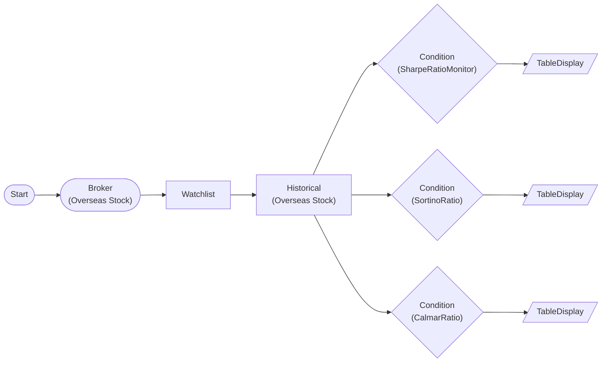

# Sharpe / Sortino / Calmar Performance Monitoring

Monitors risk-adjusted returns using three performance ratios. Sharpe measures total volatility-adjusted return, Sortino focuses on downside risk only, and Calmar measures CAGR relative to maximum drawdown.

> ## Performance Ratios
- **Sharpe**: Excess return / total volatility (> 1.0 = good)
- **Sortino**: Excess return / downside deviation only (> 1.5 = good)
- **Calmar**: CAGR / max drawdown (> 1.0 = good)
- Sortino > Sharpe indicates asymmetric upside return structure

## Workflow Structure

## Node List

| ID | Type | Description |
|----|------|------|
| start | StartNode | Workflow start |
| broker | OverseasStockBrokerNode | Overseas stock broker connection |
| watchlist | WatchlistNode | Define watchlist symbols |
| historical | OverseasStockHistoricalDataNode | 1-year historical close prices |
| sharpe | ConditionNode | Sharpe ratio (60-day, rf=4%) |
| sortino | ConditionNode | Sortino ratio (60-day, MAR=0%) |
| calmar | ConditionNode | Calmar ratio (252-day) |
| sharpe_table | TableDisplayNode | Sharpe results (ratio, return%, vol%) |
| sortino_table | TableDisplayNode | Sortino results (ratio, dd%, return%) |
| calmar_table | TableDisplayNode | Calmar results (ratio, cagr%, mdd%) |

## Key Settings

- **watchlist**: AAPL, MSFT, GOOGL, NVDA
- **historical**: 252-day lookback (1 year)
- **sharpe**: Plugin `SharpeRatioMonitor`, lookback=60, risk_free_rate=0.04, threshold=1.0
- **sortino**: Plugin `SortinoRatio`, lookback=60, mar=0.0, threshold=1.5
- **calmar**: Plugin `CalmarRatio`, lookback=252, threshold=1.0

## Required Credentials

| ID | Type | Description |
|----|------|------|
| broker_cred | broker_ls_overseas_stock | LS Securities Overseas Stock API |

## Data Flow

1. **start** --> **broker** --> **watchlist** --> **historical** (auto-iterate, 1-year data)
1. **historical** --> **sharpe** (items.extract: symbol, exchange, date, close)
1. **historical** --> **sortino** (items.extract: symbol, exchange, date, close)
1. **historical** --> **calmar** (items.extract: symbol, exchange, date, close)
