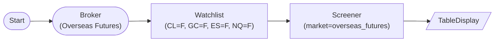

# Overseas Futures Screener (yfinance fallback)

OverseasFuturesBrokerNode → WatchlistNode → ScreenerNode(market='overseas_futures'): filter overseas futures contracts by volume and price. `data_source='auto'` routes to yfinance (LS branch for futures is not yet implemented).

## Workflow Structure

## Node List

| ID | Type | Description |
|----|------|------|
| start | StartNode | Workflow start |
| broker | OverseasFuturesBrokerNode | LS overseas futures broker (paper_trading=true) |
| watchlist | WatchlistNode | Curated futures symbols (CL=F, GC=F, ES=F, NQ=F) |
| screener | ScreenerNode | Filter by volume_min=100K and price_min=$10 |
| display | TableDisplayNode | Show screened futures contracts |

## Required Credentials

| ID | Type | Description |
|----|------|------|
| futures_cred | broker_ls_overseas_futures | LS Securities overseas futures API |

## Data Flow

1. **start** (StartNode) --> **broker** (OverseasFuturesBrokerNode)
1. **broker** (OverseasFuturesBrokerNode) --> **watchlist** (WatchlistNode)
1. **watchlist** (WatchlistNode) --> **screener** (ScreenerNode)
1. **screener** (ScreenerNode) --> **display** (TableDisplayNode)

## Notes

- Stock-only filters (`market_cap_min/max`, `sector`) are hidden by `visible_when` when `market='overseas_futures'`; the executor also forces them to None with a warning if accidentally set.
- `WatchlistNode` is required upstream — the SP500 yfinance fallback is meaningless for futures, so the ScreenerNode raises an explicit error if no input symbols are provided for `overseas_futures`.
- Setting `data_source='ls'` here logs a warning and falls back to yfinance (LS futures branch not yet implemented); leave `data_source='auto'` to silence the warning.
