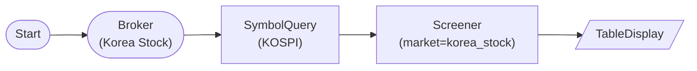

# Korea Stock Screener (KOSPI universe + yfinance fallback)

KoreaStockBrokerNode → KoreaStockSymbolQueryNode (KOSPI all symbols) → ScreenerNode(market='korea_stock'): filter Korean stocks by price and volume. The LS branch for `korea_stock` is not yet implemented, so the executor falls back to yfinance (use `data_source='auto'` to avoid warnings).

## Workflow Structure

## Node List

| ID | Type | Description |
|----|------|------|
| start | StartNode | Workflow start |
| broker | KoreaStockBrokerNode | LS Korea stock broker |
| symquery | KoreaStockSymbolQueryNode | KOSPI full symbol universe |
| screener | ScreenerNode | Filter by price_min=10,000 KRW and volume_min=100K |
| display | TableDisplayNode | Show screened Korean stocks |

## Required Credentials

| ID | Type | Description |
|----|------|------|
| broker_cred | broker_ls_korea_stock | LS Securities Korea Stock API |

## Data Flow

1. **start** (StartNode) --> **broker** (KoreaStockBrokerNode)
1. **broker** (KoreaStockBrokerNode) --> **symquery** (KoreaStockSymbolQueryNode)
1. **symquery** (KoreaStockSymbolQueryNode) --> **screener** (ScreenerNode)
1. **screener** (ScreenerNode) --> **display** (TableDisplayNode)

## Notes

- KRW values are used for price/market-cap filters when `market='korea_stock'` (vs USD for `overseas_stock`). `price_min=10000` means 10,000 KRW per share.
- `KoreaStockSymbolQueryNode` upstream is required — the SP500 yfinance fallback is irrelevant for KOSPI, so the ScreenerNode raises an explicit error if no input symbols are provided for `korea_stock`.
- Setting `data_source='ls'` here logs a warning and falls back to yfinance (LS Korea-stock branch not yet implemented); leave `data_source='auto'` to silence the warning.
- The yfinance fallback may have delays for Korean tickers (suffix `.KS` for KOSPI, `.KQ` for KOSDAQ); the screener relies on the symbol/exchange fields emitted by `KoreaStockSymbolQueryNode`.
