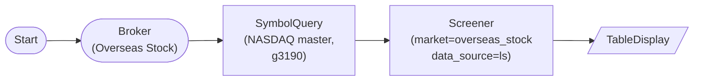

# Overseas Stock Screener (LS g3190 master + market-cap filter)

OverseasStockBrokerNode → OverseasStockSymbolQueryNode (g3190 master query, NASDAQ universe) → ScreenerNode(market='overseas_stock', data_source='ls'): screen overseas stocks using LS Securities g3190 master-quote response (price + market_cap). This is the canonical input pattern for `data_source='ls'`.

## Workflow Structure

## Node List

| ID | Type | Description |
|----|------|------|
| start | StartNode | Workflow start |
| broker | OverseasStockBrokerNode | LS overseas stock broker |
| universe | OverseasStockSymbolQueryNode | NYSE/AMEX universe via g3190 (price + market_cap enriched, up to 500) |
| screener | ScreenerNode | LS-sourced screening: market_cap >= $10B, price >= $50 |
| display | TableDisplayNode | Show top 20 large-cap NYSE/AMEX stocks |

## Required Credentials

| ID | Type | Description |
|----|------|------|
| broker_cred | broker_ls_overseas_stock | LS Securities overseas stock API |

## Data Flow

1. **start** (StartNode) --> **broker** (OverseasStockBrokerNode)
1. **broker** (OverseasStockBrokerNode) --> **universe** (OverseasStockSymbolQueryNode)
1. **universe** (OverseasStockSymbolQueryNode) --> **screener** (ScreenerNode)
1. **screener** (ScreenerNode) --> **display** (TableDisplayNode)

## Notes

- The LS branch of ScreenerNode expects input symbols that already contain `price` and `market_cap` fields (the shape emitted by g3190). `OverseasStockSymbolQueryNode` is the canonical producer of that shape.
- For workflows that start from a curated `WatchlistNode` (which only emits `{symbol, exchange}`), set `data_source='yfinance'` instead — the LS branch will try g3101 per-symbol enrichment as a last resort, but that path is rate-limited and depends on market hours.
- USD values are used for price/market-cap filters when `market='overseas_stock'`. `market_cap_min=10_000_000_000` filters for stocks above $10B market cap (large-cap demo).
- `stock_exchange='81'` queries the NYSE/AMEX universe (broader alphabet diversity for blue chips). Use `'82'` for NASDAQ. `country='US'` is the default for US exchanges.
- LS is currently implemented only for `overseas_stock`; futures and Korea stocks fall back to yfinance regardless of `data_source`.
