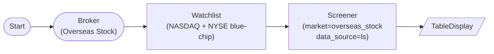

# Overseas Stock Screener (LS API direct)

OverseasStockBrokerNode → WatchlistNode → ScreenerNode(market='overseas_stock', data_source='ls'): screen overseas stocks using LS Securities g3190 (quote) + g3101 (volume) instead of yfinance. `data_source='auto'` with a broker connected behaves the same way.

## Workflow Structure

## Node List

| ID | Type | Description |
|----|------|------|
| start | StartNode | Workflow start |
| broker | OverseasStockBrokerNode | LS overseas stock broker |
| watchlist | WatchlistNode | NASDAQ + NYSE blue-chip symbols (AAPL, MSFT, NVDA, TSLA, JPM, BAC) |
| screener | ScreenerNode | LS-sourced screening with price_min=$50, volume_min=1M |
| display | TableDisplayNode | Show screened stocks |

## Required Credentials

| ID | Type | Description |
|----|------|------|
| broker_cred | broker_ls_overseas_stock | LS Securities overseas stock API |

## Data Flow

1. **start** (StartNode) --> **broker** (OverseasStockBrokerNode)
1. **broker** (OverseasStockBrokerNode) --> **watchlist** (WatchlistNode)
1. **watchlist** (WatchlistNode) --> **screener** (ScreenerNode)
1. **screener** (ScreenerNode) --> **display** (TableDisplayNode)

## Notes

- `data_source='ls'` forces the LS fast path (g3190 for quote/market-cap, g3101 for volume); without a connected `OverseasStockBrokerNode` the executor would raise an explicit error.
- USD values are used for price/market-cap filters when `market='overseas_stock'`. `price_min=50.0` means $50 USD per share, `volume_min=1000000` means 1M average daily shares.
- For workflows that need to avoid LS and use yfinance instead, set `data_source='yfinance'` explicitly — the screener will skip LS even with a broker connected.
- LS is currently implemented only for `overseas_stock`; futures and Korea stocks fall back to yfinance regardless of `data_source`.
