# 81. HKEX 다종목 RSI+Bollinger 복합 진입 (모의투자)

> **카테고리**: HKEX 해외선물 모의투자 / 다종목 auto-iterate / 복합 조건 진입
> **시장**: HKEX (Mini Hang Seng + Mini HSCEI)
> **모드**: 모의투자 (`paper_trading=true`)
> **주기**: 평일 KST 10:15-17:30, 30분 간격

---

## 🎯 전략 요약

미니항셍·미니H주 두 종목을 30분마다 스캔. **RSI 과매도 AND Bollinger 하단 터치**
두 조건이 동시에 충족된 종목에 한해 ATR 기반 사이징으로 **limit 매수**.

- **RSI**: period=14, threshold=30, direction=below (과매도)
- **Bollinger**: period=20, std_dev=2.0, position=below_lower (하단 이탈)
- **Logic**: `operator: all` — 두 조건 모두 통과한 종목만 진입
- **Sizing**: ATR 기반 (계좌 최대 5%, 종목당 1% 위험)
- **Order**: `order_type=limit` (HKEX 모의투자 제약, price = sizing.order.price)
- **Filter**: 이미 보유 중인 월물 자동 제외 (SymbolFilter difference)

---

## ⚠️ HKEX 모의투자 제약 (예제 안에 반영됨)

| 제약 | 본 예제 반영 |
|------|-------------|
| 시장가 주문 불가 | 모든 NewOrderNode `order_type: "limit"` 강제 |
| 거래소: HKEX 만 | Watchlist 두 종목 모두 `exchange: HKEX` |
| 통화: HKD | balance/price 는 HKD 단위 (KRW 환산 시 별도 환율 노드 필요) |
| 거래시간 (KST) | TradingHoursFilter `10:15-17:30 Asia/Seoul` (데이세션만) |
| 점심 휴장 13:00-14:00 KST | 본 예제 단일 윈도우 — 점심 시 cron 발사도 다음 사이클에서 자연 진입 |
| T+1 야간 18:15-04:00(+1) | 본 예제 미포함 — 보유 포지션 모니터링은 예제 82 참조 |
| 월물 만기 / Roll-over | 본 예제 분기물 M(6월) 사용. 만기 임박 roll-over 자동화는 예제 85 참조 |

> `TradingHoursFilterNode` 는 현재 단일 윈도우만 지원합니다 (multi-window / wrap-around 미지원).
> HKEX 야간세션·점심 휴장까지 정확히 표현하려면 LogicNode 3개 OR 패턴 또는 노드 확장이 필요합니다.
> 자세한 처리 방안은 `00-workflow-guide.md` HKEX 섹션 참조.

---

## 🧱 워크플로우 구성

```mermaid
flowchart LR
    start([StartNode]) --> broker[OverseasFuturesBrokerNode<br/>paper_trading=true]
    broker --> schedule[ScheduleNode<br/>*/30 * * * 1-5 KST]
    schedule --> hours[TradingHoursFilterNode<br/>10:15-17:30 KST]
    hours --> watchlist[WatchlistNode<br/>HMHM26, HMCEM26]
    watchlist --> historical[HistoricalDataNode<br/>60d 1d auto-iterate]
    historical --> rsi[ConditionNode RSI<br/>period=14 threshold=30]
    historical --> boll[ConditionNode Bollinger<br/>period=20 std_dev=2.0]
    rsi --> logic[LogicNode<br/>operator=all]
    boll --> logic
    hours --> account[OverseasFuturesAccountNode]
    logic --> filter[SymbolFilterNode<br/>difference vs held]
    account --> filter
    filter --> ifc{IfNode<br/>후보 is_not_empty}
    ifc -->|true| market[MarketDataNode]
    ifc -->|false| notice[SummaryDisplayNode<br/>no_entry]
    market --> sizing[PositionSizingNode<br/>atr_based max 5%]
    account --> sizing
    sizing --> order[NewOrderNode<br/>side=buy limit]
    order --> telegram[TelegramNode]
```



---

## 🔧 노드 사양

| 노드 | 역할 | 핵심 설정 |
|------|------|-----------|
| `start` / `broker` | 진입점 + 모의 브로커 | `paper_trading=true` |
| `schedule` | 30분 간격 cron | `*/30 * * * 1-5`, `timezone=Asia/Seoul` |
| `trading_hours` | KST 데이세션 게이트 | `10:15-17:30`, mon-fri |
| `watchlist` | 후보 종목 | HMHM26, HMCEM26 |
| `historical` | 60일 일봉 (auto-iterate per symbol) | `interval=1d` |
| `rsi_condition` | RSI 과매도 | `period=14, threshold=30, direction=below` |
| `bollinger_condition` | 볼린저 하단 | `period=20, std_dev=2.0, position=below_lower` |
| `logic` | AND 결합 | `operator=all` — RSI 와 Bollinger 모두 통과한 symbol 만 출력 |
| `account` | 잔고 + held_symbols | 사이징 + 보유 필터 양쪽 입력 |
| `filter_buy` | 보유 종목 제외 | `operation=difference` (logic.passed - account.held) |
| `if_candidates` | 후보 존재 게이트 | `operator=is_not_empty` — 후보 0개면 주문 체인 전체 스킵 |
| `no_entry_notice` | 무진입 사유 표시 | `if_candidates.false` 분기 — rsi/bollinger/held 현황 dump |
| `market_data` | 현재가 (auto-iterate per filtered symbol) | `if_candidates.true` 분기, sizing 입력용 |
| `sizing` | ATR 기반 사이징 | `method=atr_based, max_percent=5.0, atr_risk_percent=1.0` |
| `buy_order` | limit 매수 | `order_type=limit`, `order={{ nodes.sizing.order }}`, resilience skip |
| `telegram` | 알림 | 진입 종목·수량·가격 메시지 |

---

## 🔐 Credential 설정

| credential_id | 타입 | 필드 |
|---------------|------|------|
| `broker_cred` | `broker_ls_overseas_futures` | `appkey` / `appsecret` |
| `telegram_cred` | `telegram` | `bot_token` / `chat_id` |

LS 모의 서버용 키는 `programgarden_finance.docs/login.md` 참조.

---

## ✅ 검증 결과

### L1 — 정적 validate

```bash
cd src/programgarden
poetry run python -c "
import json
from programgarden import WorkflowExecutor
with open('examples/workflows/81-hkex-multi-symbol-rsi-bollinger.json') as f:
    wf = json.load(f)
r = WorkflowExecutor().validate(wf)
print('is_valid:', r.is_valid, '/ errors:', len(r.errors), '/ warnings:', len(r.warnings))
print('recs:', [x.rule_id for x in r.static_recommendations])
"
```

→ `is_valid: True / errors: 0 / warnings: 0 / recs: ['REC_EXTERNAL_API_RESILIENCE']`

`REC_EXTERNAL_API_RESILIENCE` 는 AccountNode / HistoricalData / MarketData 에 resilience
가 미설정이라는 정보성 권고입니다. 본 예제는 NewOrderNode 에만 `resilience.fallback.mode=skip`
적용 — 주문 중복 방지를 위해 데이터 수집 노드의 retry 는 의도적으로 생략.

### L2 — dry_run cycle

```bash
poetry run pytest tests/test_examples_validation.py::TestWorkflowDryRunCycle::test_workflow_dry_run_cycle[81-hkex-multi-symbol-rsi-bollinger] -v
```

→ `status: completed, errors_count: 0`. Auto-iterate (Watchlist → Historical → RSI → Bollinger → Logic) 전 체인 정상.

### L3 — 실 모의계좌 시세 read (2026-05-29 호스트 실행 ✅)

`examples/programmer_example/test_hkex_81_l3_read.py` (NewOrder/Telegram strip 한
read-only 변환) 로 실 LS 해외선물 모의 appkey (`APPKEY_FUTURE_FAKE`) 실행 결과:

| 노드 | 결과 |
|------|------|
| `account.balance` | ✅ 통화별 잔고 수신 (HKD 1,000,130 등) |
| `account.positions` | `[]` (무포지션, 정상) |
| `historical.value` | ✅ HMHM26 / HMCEM26 60일 일봉 time_series 정상 수신 |
| `rsi_condition.passed_symbols` | ✅ `[HMHM26, HMCEM26]` (둘 다 RSI<30 과매도 통과) |
| `bollinger_condition.passed_symbols` | `[]` (현 시점 하단 미터치 — 실 시장 상태, 정상) |
| `logic` (AND) | 교집합 없음 → 무진입 → `no_entry_notice` 분기 |
| **errors** | **0** |

> ⚠️ **월물 만기 주의**: 최초 작성 시 4월물(`HMHJ26`/`HMCEJ26`) 사용 → 2026-05-29 시점
> 이미 만기 경과로 historical 이 **빈 배열**(silent) 반환. live 6월물(`HMHM26`/`HMCEM26`)
> 로 roll-forward 하여 해결. 선물 예제는 만기마다 월물 갱신 필요 — `00-workflow-guide.md`
> HKEX 섹션 참조.

### L4 — mock 주문 1건 (사용자 트리거 — pending)

L4 (실 모의계좌 limit 주문 1건 → cancel, A-4 idempotency 검증) 는 Claude 가 직접
주문하지 않습니다. 사용자가 모의 appkey 로 직접 트리거하세요.

---

## 🔍 학습 포인트

1. **다종목 auto-iterate**: Watchlist (2개) → Historical 이 자동으로 종목당 1회 실행.
   ConditionNode 도 동일하게 종목당 평가 → LogicNode 가 교집합 산출.
2. **복합 조건**: RSI + Bollinger 같은 momentum/volatility 결합으로 false positive 감소.
3. **HKEX limit-only 패턴**: NewOrderNode `order_type=limit` + `order={{ nodes.sizing.order }}`
   (sizing 출력에 price 포함).
4. **A-3 회귀 가드**: 다종목 NewOrderNode auto-iterate 시 per-item spacing 이 자동 적용
   (`_rate_limit.min_interval_sec`).
5. **resilience skip**: 사이징 결과가 비어있거나 API 일시 오류 시 주문 skip — 다음 사이클에 재시도.

---

## 🔗 관련 예제

- **60-bollinger-reversion-bot**: 단일 시장 (overseas_stock) Bollinger 평균회귀
- **61-hkex-futures-bot**: HKEX 단일 조건 (Bollinger only) 시장가 패턴
- **62-rsi-futures-bot**: 해외선물 단일 조건 (RSI only)
- **82-hkex-realtime-stop-loss**: 본 예제로 진입한 포지션의 실시간 손절
- **85-hkex-screener-conditional-entry**: 월물 roll-over 자동화

---

## 📝 변경 이력

- 2026-05-28: 신규 추가 (`feat/hkex-futures-examples`)
- 2026-05-29: L3 호스트 검증 — 만기 경과 4월물 → live 6월물(HMHM26/HMCEM26) roll-forward,
  무진입 경로에 `if_candidates` IfNode(is_not_empty) + `no_entry_notice` 게이트 추가
  (market_data 빈입력 hard error 제거)
