# 81. HKEX 다종목 RSI+Bollinger 복합 진입 (모의투자)

> **카테고리**: HKEX 해외선물 모의투자 / 다종목 auto-iterate / 복합 조건 진입
> **시장**: HKEX (Mini Hang Seng + Mini HSCEI)
> **모드**: 모의투자 (`paper_trading=true`)
> **주기**: 평일 KST 10:15-17:30, 30분 간격

---

## 🎯 전략 요약

미니항셍·미니H주 두 종목을 30분마다 스캔. **RSI 과매도 AND Bollinger 하단 터치**
두 조건이 동시에 충족된 종목에 한해 ATR 기반 사이징으로 **limit 매수**.

- **종목 지정**: `FuturesContractNode` 에 **기초자산 코드**(`HMH`=미니 항셍, `HMCE`=미니 H주)만 적습니다.
  실제 월물 종목코드는 **실행 시점에 LS 종목마스터(o3101)를 조회해 근월물로 자동 해소**되므로,
  만기가 지나도 워크플로우가 조용히 죽지 않고 자동으로 다음 월물을 따라갑니다.
- **RSI**: period=14, threshold=30, direction=below (과매도)
- **Bollinger**: period=20, std_dev=2.0, position=below_lower (하단 이탈)
- **Logic**: `operator: all` — 두 조건 모두 통과한 종목만 진입
- **Sizing**: ATR 기반 (계좌 최대 5%, 종목당 1% 위험)
- **Order**: `order_type=limit` (HKEX 모의투자 제약, price = sizing.order.price)
- **Filter**: 이미 보유 중인 월물 자동 제외 (SymbolFilter difference)

---

## ⚠️ HKEX 모의투자 제약 (예제 안에 반영됨)

| 제약 | 본 예제 반영 |
|------|-------------|
| 시장가 주문 불가 | 모든 NewOrderNode `order_type: "limit"` 강제 |
| 거래소: HKEX 만 | `FuturesContractNode.futures_exchange: "HKEX"` — 해소되는 월물 모두 HKEX |
| 통화: HKD | balance/price 는 HKD 단위 (KRW 환산 시 별도 환율 노드 필요) |
| 거래시간 (KST) | TradingHoursFilter `10:15-17:30 Asia/Seoul` (데이세션만) |
| 점심 휴장 13:00-14:00 KST | 본 예제 단일 윈도우 — 점심 시 cron 발사도 다음 사이클에서 자연 진입 |
| T+1 야간 18:15-04:00(+1) | 본 예제 미포함 — 보유 포지션 모니터링은 예제 82 참조 |
| 월물 만기 / Roll-over | `FuturesContractNode` (`contract_selection: "front"`) 가 실행 시점마다 근월물을 다시 고름 — 별도 roll-over 불필요 |

> `TradingHoursFilterNode` 는 현재 단일 윈도우만 지원합니다 (multi-window / wrap-around 미지원).
> HKEX 야간세션·점심 휴장까지 정확히 표현하려면 LogicNode 3개 OR 패턴 또는 노드 확장이 필요합니다.
> 자세한 처리 방안은 `00-workflow-guide.md` HKEX 섹션 참조.

---

## 🧱 워크플로우 구성

```mermaid
flowchart LR
    start([StartNode]) --> broker[OverseasFuturesBrokerNode<br/>paper_trading=true]
    broker --> schedule[ScheduleNode<br/>*/30 * * * 1-5 KST]
    schedule --> hours[TradingHoursFilterNode<br/>10:15-17:30 KST]
    hours --> contract[FuturesContractNode<br/>HMH, HMCE / front]
    broker --> contract
    contract --> historical[HistoricalDataNode<br/>60d 1d auto-iterate]
    historical --> rsi[ConditionNode RSI<br/>period=14 threshold=30]
    historical --> boll[ConditionNode Bollinger<br/>period=20 std_dev=2.0]
    rsi --> logic[LogicNode<br/>operator=all]
    boll --> logic
    hours --> account[OverseasFuturesAccountNode]
    logic --> filter[SymbolFilterNode<br/>difference vs held]
    account --> filter
    filter --> ifc{IfNode<br/>후보 is_not_empty}
    ifc -->|true| market[MarketDataNode]
    ifc -->|false| notice[SummaryDisplayNode<br/>no_entry]
    market --> sizing[PositionSizingNode<br/>atr_based max 5%]
    account --> sizing
    sizing --> order[NewOrderNode<br/>side=buy limit]
    order --> telegram[TelegramNode]
```



---

## 🔧 노드 사양

| 노드 | 역할 | 핵심 설정 |
|------|------|-----------|
| `start` / `broker` | 진입점 + 모의 브로커 | `paper_trading=true` |
| `schedule` | 30분 간격 cron | `*/30 * * * 1-5`, `timezone=Asia/Seoul` |
| `trading_hours` | KST 데이세션 게이트 | `10:15-17:30`, mon-fri |
| `contract` | 후보 종목 (기초자산 → 근월물 자동 해소) | `base_products=["HMH","HMCE"]`, `contract_selection=front`, `futures_exchange=HKEX` — 브로커 엣지 필수 (o3101 은 LS 세션 사용) |
| `historical` | 60일 일봉 (auto-iterate per symbol) | `interval=1d`, `symbol={{ item }}` |
| `rsi_condition` | RSI 과매도 | `period=14, threshold=30, direction=below` |
| `bollinger_condition` | 볼린저 하단 | `period=20, std_dev=2.0, position=below_lower` |
| `logic` | AND 결합 | `operator=all` — RSI 와 Bollinger 모두 통과한 symbol 만 출력 |
| `account` | 잔고 + held_symbols | 사이징 + 보유 필터 양쪽 입력 |
| `filter_buy` | 보유 종목 제외 | `operation=difference` (logic.passed - account.held) |
| `if_candidates` | 후보 존재 게이트 | `operator=is_not_empty` — 후보 0개면 주문 체인 전체 스킵 |
| `no_entry_notice` | 무진입 사유 표시 | `if_candidates.false` 분기 — rsi/bollinger/held 현황 dump |
| `market_data` | 현재가 (auto-iterate per filtered symbol) | `if_candidates.true` 분기, sizing 입력용 |
| `sizing` | ATR 기반 사이징 | `method=atr_based, max_percent=5.0, atr_risk_percent=1.0` |
| `buy_order` | limit 매수 | `order_type=limit`, `order={{ nodes.sizing.order }}`, resilience skip |
| `telegram` | 알림 | 진입 종목·수량·가격 메시지 |

---

## 🔐 Credential 설정

| credential_id | 타입 | 필드 |
|---------------|------|------|
| `broker_cred` | `broker_ls_overseas_futures` | `appkey` / `appsecret` |
| `telegram_cred` | `telegram` | `bot_token` / `chat_id` |

LS 모의 서버용 키는 `programgarden_finance.docs/login.md` 참조.

---

## ✅ 검증 결과

### L1 — 정적 validate

```bash
cd src/programgarden
poetry run python -c "
import json
from programgarden import WorkflowExecutor
with open('examples/workflows/81-hkex-multi-symbol-rsi-bollinger.json') as f:
    wf = json.load(f)
r = WorkflowExecutor().validate(wf)
print('is_valid:', r.is_valid, '/ errors:', len(r.errors), '/ warnings:', len(r.warnings))
print('recs:', [x.rule_id for x in r.static_recommendations])
"
```

→ `is_valid: True / errors: 0 / warnings: 0 / recs: ['REC_EXTERNAL_API_RESILIENCE']`

`REC_EXTERNAL_API_RESILIENCE` 는 AccountNode / HistoricalData / MarketData 에 resilience
가 미설정이라는 정보성 권고입니다. 본 예제는 NewOrderNode 에만 `resilience.fallback.mode=skip`
적용 — 주문 중복 방지를 위해 데이터 수집 노드의 retry 는 의도적으로 생략.

### L2 — dry_run cycle

```bash
poetry run pytest tests/test_examples_validation.py::TestWorkflowDryRunCycle::test_workflow_dry_run_cycle[81-hkex-multi-symbol-rsi-bollinger] -v
```

→ `status: completed, errors_count: 0`. Auto-iterate (contract → Historical → RSI → Bollinger → Logic) 전 체인 정상.

### L3 — 실 모의계좌 시세 read (2026-05-29 최초 ✅ / 2026-05-30 deb80456 재검증 ✅)

`examples/programmer_example/test_hkex_read_all.py` (NewOrder/Telegram/TradingHours
strip 한 read-only 변환) 로 실 LS 해외선물 모의 appkey (`APPKEY_FUTURE_FAKE`) 실행 결과:

| 노드 | 결과 |
|------|------|
| `account.balance` | ✅ 통화별 잔고 수신 (HKD 1,000,130 등) |
| `account.positions` | `[]` (무포지션, 정상) |
| `historical.value` | ✅ 미니 항셍 / 미니 H주 (당시 근월물) 실 OHLC time_series 정상 수신 |
| `rsi_condition.passed_symbols` | ✅ 과매도 통과 (2026-05-30 재검: 미니 H주 RSI 20.87 / price 8363) |
| `bollinger_condition.passed_symbols` | `[]` (현 시점 하단 미터치 — 실 시장 상태, 정상) |
| `logic` (AND) | 교집합 없음 → 무진입 → `no_entry_notice` 분기 |
| **errors** | **0** (양 실행 모두) |

> 2026-05-30 23:10 호스트 재검증(commit `deb80456` 이후): 전 체인 historical→RSI→
> Bollinger→Logic→account→filter→sizing 까지 `errors=0`. 이때 관측된 logic
> `is_condition_met`×2 warn 은 **cosmetic 이 아니라 진입 게이트 silent 봉쇄 버그**로 확인돼
> LogicNode 바인딩을 교정(commit `1b615da5`)했고, 바인딩-only 로는 못 잡던 다종목 AND 교집합
> 코어 버그까지 수정(commit `3bb5d284`)했다. 현재 `validate()` = **errors 0 / warn 0**.
> (무진입 path `{{ item }}` sizing 경로는 후보 0 일 때만 도는 정상 분기.)

> ✅ **월물 만기 — 근본 해결됨 (2026-07-13)**: 이 예제는 과거 월물 코드를 하드코딩했다가
> 만기가 지날 때마다 두 번 조용히 죽었다 (4월물 → 2026-05-29 빈 배열, 6월물 → 2026-07-13 빈 배열).
> LS 는 만기 경과 종목에 과거봉도 현재가도 주지 않으면서 **에러조차 내지 않기** 때문에
> 워크플로우가 실패하지 않고 그냥 아무 것도 하지 않는 상태가 된다 — 가장 위험한 실패 방식이다.
> 이제 `FuturesContractNode` 가 **실행할 때마다** LS 종목마스터(o3101)에서 상장 월물을 조회해
> 근월물을 고르므로, 월물 갱신이 더 이상 필요 없다. 예제에는 기초자산 코드(`HMH`/`HMCE`)만 남는다.

### L4 — mock 주문 1건 (✅ 라이브 PASS, 2026-06-01)

트리거 스크립트: `examples/programmer_example/test_hkex_81_l4_order.py`.
NodeRunner 로 다음 라이프사이클을 실 모의계좌에 **1건만** 검증한다:

```
market_data(현재가) → new_order(limit BUY, 현재가 -5% deep price 로 미체결 유도)
  → open_orders(미체결 확인) → cancel_order(취소) → open_orders(취소 확인)
```

실행 (실 모의 appkey 필요):

```bash
cd src/programgarden
poetry run python examples/programmer_example/test_hkex_81_l4_order.py --confirm
```

- `--confirm` (또는 env `L4_CONFIRM=1`) 없으면 주문 제출 전 `exit 3` 으로 거부.
- BUY limit 을 현재가보다 5% 아래에 깔아 체결을 피하고 즉시 취소. 시세를 못 읽으면
  (장 마감) 가격을 추정하지 않고 중단 (`--price` 로 수동 지정 가능).

> ⚠️ **A-4 idempotency 는 paper_trading 에서 설계상 우회**된다
> (`executor.py::_is_order_idempotency_enabled` — "모의투자는 중복 위험 없음").
> HKEX 모의투자가 LS 의 유일한 모의 환경이므로 **이 라이브 스크립트로는 A-4 중복차단을
> 시연할 수 없다.** 라이브는 submit→cancel 라이프사이클만 검증하고, A-4 는
> `enable_order_idempotency=True` + `paper_trading=False` 단위/통합 테스트 영역이다.

**라이브 실행 결과** (2026-06-01 장중, host-Claude 직접 발사 + 사용자 승인 override):
명령 `poetry run python examples/programmer_example/test_hkex_81_l4_order.py --confirm`,
대상 미니 항셍 (Mini Hang Seng, 당시 근월물), qty 1.

| 단계 | 노드 | 결과 |
|------|------|------|
| [1] | `market_data` | 현재가 **25,297** → BUY limit **24,032** (-5%, 미체결 유도) |
| [2] | `new_order` | `order_result.success=true`, status=`submitted`, **order_id=1076** |
| [3] | `open_orders` | 미체결 **1건** (order_id 1076, filled_quantity=0, remaining_quantity=1) → 미체결 확인 OK |
| [4] | `cancel_order` | `cancel_result.success=true` (order_id 1076 cancelled) |
| [5] | `open_orders` 재확인 | **0건** (잔존 주문 없음) |
| **최종** | — | **✅ L4 PASS — 제출→미체결→취소→확인 라이프사이클 정상** (EXIT=0) |

> 참고: 첫 시도는 `.env` 의 만료된(stale) 모의 키 탓에 LS 가 `모의투자 주문이 불가한
> 계좌입니다` 로 거부 → 사용자가 키 갱신 후 재시도하여 PASS (계좌 권한이 아니라 키 문제).
> A-4 idempotency 는 paper 우회라 미검증(위 노트 유지) — submit→cancel 라이프사이클만 라이브 확증.

---

## 🔍 학습 포인트

1. **만기에 강한 선물 종목 지정**: 월물 코드를 적지 않고 기초자산 코드만 적으면
   `FuturesContractNode` 가 실행 시점에 근월물로 해소한다. 출력 `symbols` 는
   WatchlistNode 와 동일한 `[{exchange, symbol}]` 계약이라 하류 배선은 그대로다.
   단, o3101 조회에 LS 세션이 필요하므로 **브로커 → contract 엣지가 반드시 있어야 한다.**
2. **다종목 auto-iterate**: contract (2종목) → Historical 이 자동으로 종목당 1회 실행.
   ConditionNode 도 동일하게 종목당 평가 → LogicNode 가 교집합 산출.
3. **복합 조건**: RSI + Bollinger 같은 momentum/volatility 결합으로 false positive 감소.
4. **HKEX limit-only 패턴**: NewOrderNode `order_type=limit` + `order={{ nodes.sizing.order }}`
   (sizing 출력에 price 포함).
5. **A-3 회귀 가드**: 다종목 NewOrderNode auto-iterate 시 per-item spacing 이 자동 적용
   (`_rate_limit.min_interval_sec`).
6. **resilience skip**: 사이징 결과가 비어있거나 API 일시 오류 시 주문 skip — 다음 사이클에 재시도.

---

## 🔗 관련 예제

- **60-bollinger-reversion-bot**: 단일 시장 (overseas_stock) Bollinger 평균회귀
- **61-hkex-futures-bot**: HKEX 단일 조건 (Bollinger only) 시장가 패턴
- **62-rsi-futures-bot**: 해외선물 단일 조건 (RSI only)
- **82-hkex-realtime-stop-loss**: 본 예제로 진입한 포지션의 실시간 손절
- **85-hkex-screener-conditional-entry**: 월물 roll-over 자동화

---

## 📝 변경 이력

- 2026-05-28: 신규 추가 (`feat/hkex-futures-examples`)
- 2026-05-29: L3 호스트 검증 — 만기 경과 4월물 → live 6월물로 roll-forward,
  무진입 경로에 `if_candidates` IfNode(is_not_empty) + `no_entry_notice` 게이트 추가
  (market_data 빈입력 hard error 제거)
- 2026-05-30: 호스트 라이브 재검증 전 체인 errors=0; logic `is_condition_met` warn 이 진입
  게이트 silent 봉쇄 버그로 확인 → LogicNode 바인딩 올바른 관례로 교정 (commit `1b615da5`)
- 2026-05-31: LogicNode 다종목 auto-iterate AND 교집합 코어 버그 수정 (executor.py, commit
  `3bb5d284`) — 바인딩-only 수정이 못 잡던 더 깊은 결함. `validate()` errors 0 / warn 0.
- 2026-07-13: 6월물 만기 경과로 historical 이 다시 빈 배열 → 9월물로 roll-forward
  (실전 키로 월물 유효성 실측: 6월물 0봉 / 9월물 21봉). 아울러 실행기의
  auto-iterate 결함 4건을 수정 — `LogicNode` 가 auto-iterate 대상이라 `passed_symbols` 가
  N² 로 부풀던 것 포함(이 예제도 영향). 상세는 `CHANGELOG.md` 1.26.0 Fixed 참조.
- 2026-07-13: **월물 하드코딩 근본 제거** — `WatchlistNode`(HMH·HMCE 9월물 고정)를
  `FuturesContractNode`(`base_products=["HMH","HMCE"]`, `contract_selection=front`,
  `futures_exchange=HKEX`)로 교체하고 `broker → contract` 엣지 추가(o3101 이 LS 세션 사용).
  이제 만기가 지나도 실행 시점에 근월물이 자동 선택되므로 roll-forward 작업이 사라진다.
  전략·조건·스케줄·노드 수는 그대로 (심볼 출처만 교체). `validate()` errors 0 / warnings 0.
