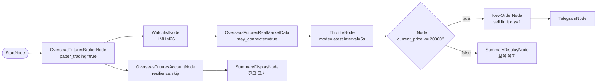

# 82. HKEX 실시간 손절 자동매매 (모의투자)

> **카테고리**: HKEX 해외선물 모의투자 / 실시간 → IfNode 분기 / Stop-loss 자동매도
> **시장**: HKEX (Mini Hang Seng 단일 포지션 데모)
> **모드**: 모의투자 (`paper_trading=true`)
> **가동**: 24시간 연속 (T+1 야간세션 포함)

---

## 🎯 전략 요약

단일 보유 포지션의 실시간 가격을 WebSocket 으로 구독, **ThrottleNode** 로 tick rate 를
5초 단위로 안정화한 뒤, **IfNode** 가 `current_price <= stop_price` 도달 시
**limit 매도**로 청산.

- **종목**: HMHM26 (Mini Hang Seng 6월) — 단일 시범 보유
- **stop_price**: 20,000 HKD (정적 상수, 데모용)
- **주문**: `side=sell`, `order_type=limit`, `price={{ throttle.data.current_price }}`
- **체결 후**: Telegram 즉시 알림
- **stop 미도달**: SummaryDisplayNode 가 현재가/상태 표시

> 실 운영 시 stop_price 는 AccountNode 의 position 평균진입가 기반으로 동적 계산하는 것이 정석.
> 본 예제는 **패턴 시연** 에 초점. 동적 stop 계산 시 FieldMappingNode 또는 ConditionNode (position-management plugin) 활용.

---

## ⚠️ HKEX 모의투자 + Connection Rule 검증

| 제약 / 규칙 | 본 예제 반영 |
|------------|-------------|
| HKEX 시장가 주문 불가 | `close_order.order_type=limit` + `price={{ throttle.data.current_price }}` |
| **Connection Rule A-2** (realtime→order 직결 금지) | `RealMarketData → ThrottleNode → IfNode → NewOrder` 강제. ThrottleNode 제거 시 `validate()` 가 `REC_REALTIME_THROTTLE` 권고 |
| **balance partial-failure** | AccountNode `resilience.fallback.mode=skip`. TR 일부 실패 시 `balance._partial_failure=true` + `orderable_amount=None` 노출 (silent 0 흡수 차단) |
| 거래시간 | TradingHoursFilter **제거**. realtime tick 자체가 휴장 시 안 오므로 자연 정지 (KST 10:15-17:30 데이세션 + 18:15-04:00(+1) 야간) |
| HKEX 점심/저녁 휴장 (KST 13:00-14:00, 17:30-18:15) | tick 미도착 → 자연 idle. ThrottleNode 가 stale tick 으로 오동작 안 함 (`mode=latest, interval_sec=5`) |

---

## 🧱 워크플로우 구성



---

## 🔧 노드 사양

| 노드 | 역할 | 핵심 설정 |
|------|------|-----------|
| `start` / `broker` | 진입 + 모의 브로커 | `paper_trading=true` |
| `watchlist` | 보유 종목 1개 | HMHM26 |
| `realtime` | tick 구독 | `symbol={{ item }}`, `stay_connected=true` |
| `throttle` | tick rate 안정화 | `mode=latest, interval_sec=5.0, pass_first=true` |
| `if_stop` | stop 조건 분기 | `left={{ throttle.data.current_price }}, operator=<=, right=20000.0` |
| `close_order` | 손절 매도 (true 분기) | `side=sell, order_type=limit, price=current_price, resilience.skip` |
| `telegram_stop` | 손절 알림 | 종목/체결가 메시지 |
| `hold_notice` | 보유 유지 표시 (false 분기) | 현재가 / stop_price / status |
| `account` | 잔고 (balance partial-failure 폴백 데모) | `resilience.fallback.mode=skip` |
| `balance_summary` | 잔고 + `_partial_failure` 노출 | silent-failure 가드 데모 |

---

## 🔐 Credential 설정

| credential_id | 타입 | 필드 |
|---------------|------|------|
| `broker_cred` | `broker_ls_overseas_futures` | `appkey` / `appsecret` |
| `telegram_cred` | `telegram` | `bot_token` / `chat_id` |

---

## ✅ 검증 결과

### L1 — 정적 validate

```bash
poetry run python -c "
import json
from programgarden import WorkflowExecutor
with open('examples/workflows/82-hkex-realtime-stop-loss.json') as f:
    wf = json.load(f)
r = WorkflowExecutor().validate(wf)
print('is_valid:', r.is_valid, '/ errors:', len(r.errors), '/ warnings:', len(r.warnings))
print('recs:', [x.rule_id for x in r.static_recommendations])
"
```

→ `is_valid: True / errors: 0 / warnings: 0 / recs: ['REC_EXTERNAL_API_RESILIENCE', 'REC_AUTO_ITERATE_AGGREGATE_MISSING']`

두 권고 모두 informational. **`REC_REALTIME_THROTTLE` 가 발화하지 않음** = Connection Rule A-2 충족.

### L2 — dry_run cycle

```bash
poetry run pytest tests/test_examples_validation.py::TestWorkflowDryRunCycle::test_workflow_dry_run_cycle[82-hkex-realtime-stop-loss] -v
```

→ `status: completed, errors_count: 0`. IfNode `branch=false` (mock current_price=None), `close_order`/`telegram_stop` cascading skip, `hold_notice` 실행. balance_summary 가 `_partial_failure=true` + `orderable_amount=None` 정상 노출.

### L3-L4 — 실 모의계좌 검증 (사용자 트리거)

L3: 실 모의 appkey 로 실제 tick 수신 + IfNode 가 false 분기로 동작 확인 (stop_price 충분히 낮게 설정).
L4: stop_price 를 의도적으로 시장가 위로 설정해 매도 1건 트리거 → 체결 확인 → cancel.

---

## 🔍 학습 포인트

1. **Connection Rule A-2**: realtime→order 직결 금지. ThrottleNode 가 tick storm → 주문 폭주를 차단.
2. **IfNode 분기 + 캐스케이딩 스킵**: `from_port: true/false` 명시. 비활성 분기의 하위 노드 자동 스킵.
3. **balance partial-failure**: AccountNode 의 `_partial_failure` flag + `orderable_amount=None` 가 silent 0 흡수를 차단. resilience skip 으로 워크플로우 중단 없이 다음 사이클 복구.
4. **HKEX limit-only**: realtime tick price 를 그대로 limit price 로 사용 — 빠른 체결.
5. **24시간 가동**: TradingHoursFilter 제거. tick 자체가 휴장 시 안 오므로 자연 idle. ThrottleNode `mode=latest` 가 stale tick 발사 방지.

---

## 🔗 관련 예제

- **39-realtime-futures-tick**: HKEX realtime 기본 구독 + ThrottleNode 표시
- **61-hkex-futures-bot**: HKEX 진입 (Bollinger) — 본 예제로 손절
- **81-hkex-multi-symbol-rsi-bollinger**: HKEX 다종목 진입 — 본 예제로 손절
- **17-risk-portfolio**: PortfolioNode 로 multi-strategy 자본 배분

---

## 📝 변경 이력

- 2026-05-28: 신규 추가 (`feat/hkex-futures-examples`)
