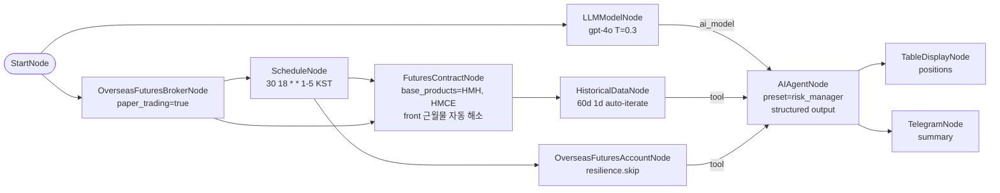

# 83. HKEX AI 리스크 매니저 일일 리포트 (모의투자)

> **카테고리**: HKEX 해외선물 모의투자 / AI Agent / Schedule + Tool 엣지 + structured output
> **시장**: HKEX (미니 항셍 HMH + 미니 H주 HMCE — 근월물 자동 해소)
> **모드**: 모의투자 (`paper_trading=true`)
> **주기**: 평일 KST 18:30 (HKEX 데이세션 마감 직후) 1회

---

## 🎯 시나리오 요약

매 거래일 HKEX 데이세션 마감 직후 (KST 18:30), **AIAgentNode** 가 `risk_manager` 프리셋으로
미니 항셍(HMH) / 미니 H주(HMCE) 두 종목의 60일 historical 캔들 + 현재 계좌 포지션을 **Tool 엣지**로 조회하여
종목별 `risk_level` (low/medium/high) + 변동성 기반 `suggested_stop_loss` + 한 줄 reasoning 을
**structured JSON** 으로 생성. Telegram 으로 요약 발송 + TableDisplayNode 콘솔 렌더링.

- **종목**: `FuturesContractNode` 가 실행 시점에 LS 종목마스터를 조회해 **근월물로 자동 해소** (월물 코드 하드코딩 없음 → 만기가 지나도 죽지 않음)
- **LLM**: gpt-4o, temperature=0.3 (저변동), max_tokens=1200
- **Tools (tool 엣지)**: AccountNode, HistoricalDataNode
- **Output**: `output_format=structured` + `output_schema` (positions[] + summary)
- **Cooldown**: 60초 (실시간 노드와 직결 불가 가드)
- **토큰 cap**: `max_total_tokens=40000` (cost 폭주 차단)
- **Stateless**: 매 실행 독립 (대화 기억 X, Tool 로 매번 최신 데이터)

---

## ⚠️ AI Agent 안전 가드

| 가드 | 본 예제 반영 |
|------|-------------|
| Connection Rule — realtime → AIAgent 직결 금지 | Schedule + Historical / Account 만 사용 (realtime 노드 없음) |
| cooldown_sec | 60초 (기본). Schedule 이 daily 라 사실상 무관 |
| max_total_tokens | 40000 (gpt-4o 60d × 2종목 ~5K input tokens + reasoning 여유) |
| output_format=structured 시 output_schema 필수 | positions[] + summary 명시 정의. Pydantic 검증으로 hallucination 차단 |
| tool_error_strategy | 기본값 `retry_with_context` 유지 — Account TR 일시 실패 시 LLM 가 재시도 |

---

## 🧱 워크플로우 구성

---

## 🔧 노드 사양

| 노드 | 역할 | 핵심 설정 |
|------|------|-----------|
| `start` / `broker` | 진입 + 모의 브로커 | `paper_trading=true` |
| `schedule` | daily 트리거 | `cron=30 18 * * 1-5, timezone=Asia/Seoul` |
| `llm` | LLM 연결 | `model=gpt-4o, temperature=0.3, max_tokens=1200` |
| `contract` | 분석 후보 종목 (근월물 자동 해소) | `base_products=["HMH","HMCE"], contract_selection=front, futures_exchange=HKEX` — 브로커 → contract 엣지 필수 (LS 세션 필요) |
| `historical` | 60일 일봉 (auto-iterate per symbol) | `symbol={{ item }}, interval=1d` |
| `account` | 현재 포지션 + balance | `resilience.fallback.mode=skip` |
| `risk_agent` | AI 리스크 매니저 | `preset=risk_manager, output_format=structured, output_schema={positions,summary}, max_tool_calls=6, cooldown_sec=60, max_total_tokens=40000` |
| `report_table` | positions 표 출력 | `data={{ risk_agent.response.positions }}` |
| `report_telegram` | summary 알림 | template 에 `{{ risk_agent.response.summary }}` |

---

## 🔐 Credential 설정

| credential_id | 타입 | 필드 |
|---------------|------|------|
| `broker_cred` | `broker_ls_overseas_futures` | `appkey` / `appsecret` |
| `llm_cred` | `llm_openai` | `api_key` |
| `telegram_cred` | `telegram` | `bot_token` / `chat_id` |

---

## ✅ 검증 결과

### L1 — 정적 validate

→ `is_valid: True / errors: 0 / warnings: 0 / recs: ['REC_EXTERNAL_API_RESILIENCE']`

informational 권고 1건. Connection Rule (realtime → AIAgent) 위반 없음.

### L2 — dry_run cycle

→ `status: completed, errors_count: 0`. LiteLLM info log 가 mock 응답 시 정상 출력.
historical auto-iterate (2종목), account, llm, risk_agent (mock structured response),
report_table, report_telegram 전 체인 정상.

### L3 — read-only feed 검증 (2026-05-30 호스트 실행 ✅)

`examples/programmer_example/test_hkex_read_all.py` (LLM/AI/Telegram strip) 로 AI 에
공급되는 read-only feed(historical + account)만 실 모의 appkey 로 실행 → feed clean,
5노드 completed 후 자연 cancel, **300s hang 재발 없음, errors=0**. (LLM 응답 자체 검증은
아래 사용자 트리거 단계.)

### L3(LLM)-L4 — 실 LLM 검증 (사용자 트리거)

L3: 사용자가 `llm_cred.api_key` 에 실제 OpenAI 키 설정 후 1회 수동 실행 → 실제 LLM 응답 + Telegram 발송 확인.
콜백 노출 검증:
- `on_token_usage` — total_tokens, cost_usd
- `on_ai_tool_call` — tool_name (account/historical), duration_ms
- `on_llm_stream` — streaming=False 라 한 번에 final chunk

L4: 본 예제는 주문 노드 없음. 별도 트리거 불필요.

---

## 🔍 학습 포인트

1. **Tool 엣지 패턴**: AccountNode / HistoricalDataNode 를 `type: "tool"` 엣지로 연결 → LLM 이 직접 호출 결정. tool 선택은 LLM 자체 reasoning 에 위임 (벡터/BM25 인프라 미사용).
2. **ai_model 엣지**: LLMModelNode → AIAgentNode 는 반드시 `type: "ai_model"` (main 엣지 X). main 엣지로 잘못 연결 시 "no LLM model configured" 에러.
3. **structured output**: `output_format=structured` + `output_schema` 로 Pydantic 검증. response 는 dict — `{{ nodes.agent.response.positions }}` / `{{ nodes.agent.response.summary }}` dot notation 으로 downstream 분기.
4. **realtime → AIAgent 차단**: AIAgentNode `_connection_rules` 가 RealMarketData 등 직결을 ERROR 로 차단. 본 예제는 Schedule + Historical/Account 만 → 안전.
5. **비용 가드**: `max_total_tokens=40000` + `cooldown_sec=60` 으로 silent 토큰 폭주 차단.
6. **월물 하드코딩 금지**: `FuturesContractNode` 가 실행 시점에 종목마스터를 조회해 기초자산(HMH/HMCE)의 근월물을 해소 → 만기가 지나도 예제가 조용히 죽지 않음. auto-iterate 소비자(`historical`)는 `symbol={{ item }}` 로 받고, auto-iterate 대상이 아닌 `risk_agent` 의 프롬프트는 `{{ nodes.contract.symbols[0].symbol }}` 인덱스 표현식으로 해소된 종목을 주입한다.

---

## 🔗 관련 예제

- **LLMModelNode/AIAgentNode 기본 예제**: core 의 `_examples` 참조
- **81-hkex-multi-symbol-rsi-bollinger**: 본 예제와 동일 종목군의 룰베이스 진입 (AI 와 룰베이스 비교 학습)
- **84-hkex-backtest-schedule-report**: 동일 daily Schedule + 룰베이스 (AI 없음) 비교

---

## 📝 변경 이력

- 2026-05-28: 신규 추가 (`feat/hkex-futures-examples`)
- 2026-07-13: `WatchlistNode`(월물 코드 하드코딩) → `FuturesContractNode`(`base_products=["HMH","HMCE"]`, front) 로 교체. 만기 경과 월물로 인한 무증상 실패(빈 데이터) 제거.
