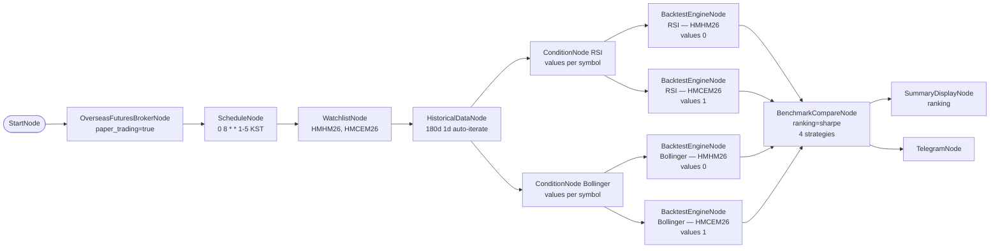

# 84. HKEX 백테스트 아침 일일 리포트 (모의투자)

> **카테고리**: HKEX 해외선물 모의투자 / BacktestEngine + BenchmarkCompare / Schedule + Telegram
> **시장**: HKEX (Mini Hang Seng + Mini HSCEI)
> **모드**: 모의투자 (`paper_trading=true`)
> **주기**: 평일 KST 08:00 (HKEX 데이세션 시작 전)

---

## 🎯 시나리오 요약

매 평일 아침 8시 (KST, HKEX 데이세션 진입 ~2시간 전), 180일 historical 로
**RSI Mean Reversion** 와 **Bollinger Reversion** 두 전략을 **종목별로** 백테스트 →
BenchmarkCompareNode 가 Sharpe 기준 ranking → SummaryDisplayNode 콘솔 + TelegramNode 아침 알림.

핵심: 백테스트는 **2종목 × 2전략 = 4개의 per-symbol BacktestEngineNode** 로 분리되며,
각 노드는 raw historical 이 아니라 **해당 전략 ConditionNode 의 per-candle annotated series**
(`{{ nodes.<cond>.values[i].time_series }}`) 를 소비한다. 각 캔들의 매매 시그널은
`{{ row.signal }}` / `{{ row.side }}` 로 직접 추출된다.

- **데이터**: 180일 일봉 × 2종목 (HMHM26, HMCEM26)
- **전략 A — RSI Mean Reversion**: RSI(14, threshold=30, direction=below) + fixed_percent 10% + stop 3% / TP 8% / time stop 10d → `backtest_rsi_hmhm`, `backtest_rsi_hmce`
- **전략 B — Bollinger Reversion**: Bollinger(20, 2.0, below_lower) + fixed_percent 10% + stop 4% / TP 10% / time stop 14d → `backtest_boll_hmhm`, `backtest_boll_hmce`
- **비용 모델**: commission 0.05% + slippage 0.1%
- **비교**: BenchmarkCompareNode `ranking_metric=sharpe` — 4개 equity_curve 동시 ranking
- **주문 X**: report-only 워크플로우

---

## ⚠️ 백테스트 주의

| 주의 | 본 예제 반영 |
|------|-------------|
| anti-pattern: 30일 같이 짧은 기간 | 180일 (~6개월) 사용. 1년+ 이 더 안정적이지만 HKEX 모의 데이터 범위 고려 |
| anti-pattern: commission/slippage 0 | 0.05% + 0.1% 설정 — 현실 비용 모델링 |
| anti-pattern: 백테스트가 raw historical 소비 | per-symbol 로 분리하고 ConditionNode 의 annotated series (`values[i].time_series`) 를 소비해야 시그널 인식. raw historical 바인딩 또는 단일 노드로 2종목 처리 시 시그널이 비어 buy-and-hold 로 silent degrade |
| 동기 실행 / cycle latency | 2종목 × 180바 × 2전략 ≈ 720바 평가 (백테스트 노드 4개). 대규모 확장 시 cycle 지연 가능 |
| 진입은 별도 워크플로우 | 본 예제는 report 전용. 실제 진입은 예제 81 (RSI+Bollinger Logic) 사용 |

---

## 🧱 워크플로우 구성

---

## 🔧 노드 사양

| 노드 | 핵심 설정 |
|------|-----------|
| `schedule` | `cron=0 8 * * 1-5, timezone=Asia/Seoul` |
| `historical` | 180d 1d auto-iterate per symbol |
| `rsi_cond` | `period=14, threshold=30, direction=below`. 종목별 annotated series 를 `values[]` 로 출력 (index 0=HMHM26, 1=HMCEM26) |
| `boll_cond` | `period=20, std_dev=2.0, position=below_lower`. 종목별 annotated series 를 `values[]` 로 출력 |
| `backtest_rsi_hmhm` | `from={{ rsi_cond.values[0].time_series }}`, signal=`{{ row.signal }}`, side=`{{ row.side }}`. initial 100k, commission 0.0005, slippage 0.001, fixed_percent 10%, stop 3%, TP 8%, time_stop 10d |
| `backtest_rsi_hmce` | `from={{ rsi_cond.values[1].time_series }}` (HMCEM26). RSI exit 파라미터 동일 |
| `backtest_boll_hmhm` | `from={{ boll_cond.values[0].time_series }}` (HMHM26). stop 4%, TP 10%, time_stop 14d |
| `backtest_boll_hmce` | `from={{ boll_cond.values[1].time_series }}` (HMCEM26). Bollinger exit 파라미터 동일 |
| `benchmark` | `strategies=[backtest_rsi_hmhm.equity_curve, backtest_rsi_hmce.equity_curve, backtest_boll_hmhm.equity_curve, backtest_boll_hmce.equity_curve], ranking_metric=sharpe` |
| `summary_display` | data=`{{ benchmark.ranking }}` |
| `telegram_morning` | 일일 ranking 알림 템플릿 |

---

## 🔐 Credential 설정

| credential_id | 타입 |
|---------------|------|
| `broker_cred` | `broker_ls_overseas_futures` |
| `telegram_cred` | `telegram` |

---

## ✅ 검증 결과

### L1 — 정적 validate

→ `is_valid: True / errors: 0 / warnings: 0 / recs: ['REC_EXTERNAL_API_RESILIENCE']`

### L2 — dry_run cycle

→ `status: completed, errors_count: 0`. historical / rsi_cond / boll_cond auto-iterate,
backtest_rsi_hmhm / backtest_rsi_hmce / backtest_boll_hmhm / backtest_boll_hmce (4개),
benchmark, summary_display, telegram_morning 전 체인 정상.

mock 환경에서는 BenchmarkCompareNode 가 빈 ranking `[]` 반환 — 정상 (auto-iterate 결과 mock 이 비어있어서). 실제 LS 모의 데이터에선 ranking 채워짐.

합성 캔들 repro (rsi_cond.values 모사: 2종목 × 40캔들, 일부 `signal='buy'/'sell'`)
로 `backtest_rsi_hmhm` 의 실제 `items` config 를 `_process_items_with_extract` →
`_convert_flat_to_symbol_dict` → `_run_simulation` 에 통과시킨 결과: rows=40,
signals=8 (buy 4 + sell 4, 전부 `row.signal` 기반 — buy-and-hold fallback 아님),
equity_curve 40포인트, trades=8. per-candle 시그널이 정상 인식됨을 확인.

### L3 — 실 모의 데이터 검증 (사용자 트리거)

L3: 실 모의 appkey 로 historical 수신 후 backtest 결과 확인. SummaryDisplay 콘솔에서
sharpe / mdd / total_return 확인.

L4: 본 예제는 주문 노드 없음 — 별도 트리거 불필요.

---

## 🔍 학습 포인트

1. **per-symbol 백테스트 + annotated series 소비**: BacktestEngineNode 는 종목당 1개로 분리하고, raw historical 이 아니라 ConditionNode 의 per-candle annotated series `{{ nodes.<cond>.values[i].time_series }}` 를 `items.from` 으로 소비해야 한다. 각 캔들 시그널은 `{{ row.signal }}` / `{{ row.side }}` 로 직접 추출. `values` 인덱스 순서 = watchlist(auto-iterate) 순서이며, 데이터가 부족한 종목도 `time_series:[]` 로 entry 가 유지되어 인덱스 정렬이 보존된다.
2. **silent buy-and-hold degrade 회피**: `_run_simulation` 은 signal 리스트가 비면 buy-and-hold 로 fallback 한다. 단일 노드로 2종목을 처리하거나 `result.signal` (merged 리스트) 을 바인딩하면 시그널이 None/빈값이 되어 모든 전략이 buy-and-hold 로 동일하게 보인다. per-symbol + `row.signal` 매핑이 비교를 유의미하게 만드는 핵심.
3. **2종목 × 2전략 = 4 백테스트**: rsi_cond / boll_cond 각각 `values[0]`(HMHM26) / `values[1]`(HMCEM26) 로 분기 → 4개 BacktestEngineNode.
4. **BenchmarkCompareNode**: 4개 equity_curve 동시 비교. `ranking_metric=sharpe` 또는 `mdd, total_return`. ranking + comparison_metrics + combined_curve 출력.
5. **Schedule 시간대 조합**: KST 08:00 → HKEX 데이세션(KST 10:15-) 전 ~2시간 여유. 사용자가 결과 확인 후 진입 결정 가능.
6. **report-only 패턴**: 주문 노드 없음 → 안전성 ↑. 진입은 별도 워크플로우 (81번).

---

## 🔗 관련 예제

- **57-futures-paper-backtest-heavy**: 3전략 × 4종목 풀세트 (메모리 부하 테스트)
- **17-risk-portfolio**: PortfolioNode 로 multi-strategy 자본 배분
- **81-hkex-multi-symbol-rsi-bollinger**: 본 예제 결과를 보고 진입 결정 → 실 진입 워크플로우

---

## 📝 변경 이력

- 2026-05-28: 신규 추가 (`feat/hkex-futures-examples`)
- 2026-05-30: per-symbol 백테스트로 재구성 — 단일 노드 2개(`backtest_rsi`/`backtest_boll`)를 종목별 4개(`backtest_rsi_hmhm`/`backtest_rsi_hmce`/`backtest_boll_hmhm`/`backtest_boll_hmce`)로 분리. `items.from` 을 raw historical → ConditionNode annotated series(`values[i].time_series`)로, signal 을 `result.signal`(merged 리스트) → `row.signal` 로 교체. benchmark.strategies 4 equity_curve. silent buy-and-hold degrade 버그 수정.
