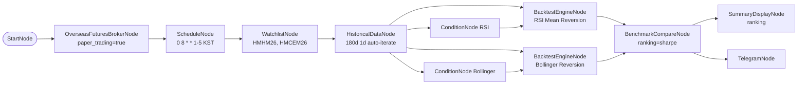

# 84. HKEX 백테스트 아침 일일 리포트 (모의투자)

> **카테고리**: HKEX 해외선물 모의투자 / BacktestEngine + BenchmarkCompare / Schedule + Telegram
> **시장**: HKEX (Mini Hang Seng + Mini HSCEI)
> **모드**: 모의투자 (`paper_trading=true`)
> **주기**: 평일 KST 08:00 (HKEX 데이세션 시작 전)

---

## 🎯 시나리오 요약

매 평일 아침 8시 (KST, HKEX 데이세션 진입 ~2시간 전), 180일 historical 로
**RSI Mean Reversion** 와 **Bollinger Reversion** 두 전략을 백테스트 → BenchmarkCompareNode
가 Sharpe 기준 ranking → SummaryDisplayNode 콘솔 + TelegramNode 아침 알림.

- **데이터**: 180일 일봉 × 2종목
- **전략 A**: RSI(14, threshold=30, direction=below) + fixed_percent 10% + stop 3% / TP 8% / time stop 10d
- **전략 B**: Bollinger(20, 2.0, below_lower) + fixed_percent 10% + stop 4% / TP 10% / time stop 14d
- **비용 모델**: commission 0.05% + slippage 0.1%
- **비교**: BenchmarkCompareNode `ranking_metric=sharpe` — 두 equity_curve 비교
- **주문 X**: report-only 워크플로우

---

## ⚠️ 백테스트 주의

| 주의 | 본 예제 반영 |
|------|-------------|
| anti-pattern: 30일 같이 짧은 기간 | 180일 (~6개월) 사용. 1년+ 이 더 안정적이지만 HKEX 모의 데이터 범위 고려 |
| anti-pattern: commission/slippage 0 | 0.05% + 0.1% 설정 — 현실 비용 모델링 |
| 동기 실행 / cycle latency | 2종목 × 180바 × 2전략 ≈ 720바 평가. 대규모 확장 시 cycle 지연 가능 |
| 진입은 별도 워크플로우 | 본 예제는 report 전용. 실제 진입은 예제 81 (RSI+Bollinger Logic) 사용 |

---

## 🧱 워크플로우 구성

---

## 🔧 노드 사양

| 노드 | 핵심 설정 |
|------|-----------|
| `schedule` | `cron=0 8 * * 1-5, timezone=Asia/Seoul` |
| `historical` | 180d 1d auto-iterate per symbol |
| `rsi_cond` | `period=14, threshold=30, direction=below` |
| `boll_cond` | `period=20, std_dev=2.0, position=below_lower` |
| `backtest_rsi` | initial 100k, commission 0.0005, slippage 0.001, fixed_percent 10%, stop 3%, TP 8%, time_stop 10d |
| `backtest_boll` | initial 100k, commission 0.0005, slippage 0.001, fixed_percent 10%, stop 4%, TP 10%, time_stop 14d |
| `benchmark` | `strategies=[rsi.equity_curve, boll.equity_curve], ranking_metric=sharpe` |
| `summary_display` | data=`{{ benchmark.ranking }}` |
| `telegram_morning` | 일일 ranking 알림 템플릿 |

---

## 🔐 Credential 설정

| credential_id | 타입 |
|---------------|------|
| `broker_cred` | `broker_ls_overseas_futures` |
| `telegram_cred` | `telegram` |

---

## ✅ 검증 결과

### L1 — 정적 validate

→ `is_valid: True / errors: 0 / warnings: 0 / recs: ['REC_EXTERNAL_API_RESILIENCE']`

### L2 — dry_run cycle

→ `status: completed, errors_count: 0`. historical / rsi_cond / boll_cond auto-iterate,
backtest_rsi / backtest_boll, benchmark, summary_display, telegram_morning 전 체인 정상.

mock 환경에서는 BenchmarkCompareNode 가 빈 ranking `[]` 반환 — 정상 (auto-iterate 결과 mock 이 비어있어서). 실제 LS 모의 데이터에선 ranking 채워짐.

### L3 — 실 모의 데이터 검증 (사용자 트리거)

L3: 실 모의 appkey 로 historical 수신 후 backtest 결과 확인. SummaryDisplay 콘솔에서
sharpe / mdd / total_return 확인.

L4: 본 예제는 주문 노드 없음 — 별도 트리거 불필요.

---

## 🔍 학습 포인트

1. **BacktestEngineNode items.from extract 패턴**: ConditionNode 의 `result.signal` / `result.side` 를 extract 에 매핑 → 백테스트가 시그널을 인식.
2. **두 전략 병렬 백테스트**: 같은 historical 입력을 두 갈래로 분기. 각 전략마다 별도 BacktestEngine.
3. **BenchmarkCompareNode**: 여러 equity_curve 비교. `ranking_metric=sharpe` 또는 `mdd, total_return`. ranking + comparison_metrics + combined_curve 출력.
4. **Schedule 시간대 조합**: KST 08:00 → HKEX 데이세션(KST 10:15-) 전 ~2시간 여유. 사용자가 결과 확인 후 진입 결정 가능.
5. **report-only 패턴**: 주문 노드 없음 → 안전성 ↑. 진입은 별도 워크플로우 (81번).

---

## 🔗 관련 예제

- **57-futures-paper-backtest-heavy**: 3전략 × 4종목 풀세트 (메모리 부하 테스트)
- **17-risk-portfolio**: PortfolioNode 로 multi-strategy 자본 배분
- **81-hkex-multi-symbol-rsi-bollinger**: 본 예제 결과를 보고 진입 결정 → 실 진입 워크플로우

---

## 📝 변경 이력

- 2026-05-28: 신규 추가 (`feat/hkex-futures-examples`)
