# 85. HKEX 근월물 스크리너 + ATR 조건 진입 (모의투자, 월물 자동 해소)

> **카테고리**: HKEX 해외선물 모의투자 / Screener + ATR / IfNode 조건 진입
> **시장**: HKEX (미니 항셍 + 미니 H주 — 기초자산 2종의 근월물)
> **모드**: 모의투자 (`paper_trading=true`)
> **주기**: 평일 KST 11:00 (HKEX 데이세션 시작 45분 후 — 초반 변동성 안정화)

---

## 🎯 시나리오 요약

**FuturesContractNode** 가 실행 시점에 미니 항셍(HMH) / 미니 H주(HMCE) 의 **현재 상장 근월물**을
해소 → **ExclusionListNode** 운영 블랙리스트 통과 → 180일 **ATR(14) breakout_up** 조건 충족
종목만 통과 → 이미 보유 중인 월물 제외 (SymbolFilter difference) → **IfNode** 가 후보 ≥ 1
일 때만 NewOrderNode 발사.

- **후보풀**: 기초자산 `HMH`(미니 항셍) + `HMCE`(미니 H주) 의 근월물 각 1건 — **실행 시점에 해소**
- **월물 코드는 어디에도 적혀 있지 않다** → 만기가 지나도 다음 월물로 자동 롤오버
- **시그널**: ATR(period=14, multiplier=2.0, direction=breakout_up)
- **사이징**: ATR 기반 (계좌 5%, 종목당 1.5% 위험)
- **주문**: limit (HKEX 모의투자 제약)
- **분기**: 후보 0 → SummaryDisplay(no_entry), 후보 ≥1 → MarketData → Sizing → Order → Telegram

---

## 🔄 월물 만기는 노드가 처리한다

선물 종목코드에 월물을 하드코딩하면 **만기가 지나는 순간 워크플로우가 조용히 죽습니다**.
LS 는 만기 경과 종목에 과거봉도 현재가도 주지 않고, **에러조차 내지 않습니다**(빈 배열).
그래서 이 예제는 월물을 적지 않고, 기초자산만 적습니다.

| | 하드코딩 (옛 방식) | FuturesContractNode (현재) |
|---|---|---|
| 워크플로우에 적는 것 | 월물 종목코드 | **기초자산 코드** (`HMH`, `HMCE`) |
| 월물 결정 시점 | 저작 시점 (고정) | **실행 시점** (LS 종목마스터 o3101 조회) |
| 만기 경과 시 | 빈 응답 → 조용히 사망 | 상장 목록에 없으므로 **자동으로 다음 월물** |
| 관리 비용 | 만기마다 파일 수정 | 없음 |

**핵심 설정**

| 필드 | 값 | 의미 |
|------|-----|------|
| `base_products` | `["HMH", "HMCE"]` | 기초자산 코드 (월물 코드가 아님). 코드마다 1건씩 해소 |
| `contract_selection` | `front` | 근월물 = 유동성 최대. (`next`=롤오버 대상, `quarterly`=3·6·9·12월) |
| `futures_exchange` | `HKEX` | 거래소 필터 |

출력 `symbols` 는 `[{exchange, symbol}]` 로 **WatchlistNode 와 동일한 계약**이라,
하류(Exclusion → Historical → Condition) 배선은 그대로 둡니다.

> **ExclusionListNode 의 역할 변경**: 만기 차단은 이제 contract 노드가 구조적으로 해결하므로,
> 이 노드는 **운영 블랙리스트 훅**으로 남습니다(기본값 빈 목록 = 후보풀 그대로 통과).
> 리스크/유동성 사유로 종목을 넣으면 후보풀에서 빠지고, 주문 노드도 그 종목을 차단합니다.

---

## 🧱 워크플로우 구성

```mermaid
flowchart LR
    start([StartNode]) --> broker[OverseasFuturesBrokerNode<br/>paper_trading=true]
    broker --> schedule[ScheduleNode<br/>0 11 * * 1-5 KST]
    schedule --> hours[TradingHoursFilterNode<br/>10:15-17:30 KST]

    hours --> contract[FuturesContractNode<br/>HMH + HMCE / front]
    broker --> contract
    contract --> exclusion[ExclusionListNode<br/>운영 블랙리스트 + input_symbols]
    exclusion --> historical[HistoricalDataNode<br/>180d 1d auto-iterate]
    historical --> atr[ConditionNode ATR<br/>period=14 breakout_up]

    hours --> account[OverseasFuturesAccountNode<br/>resilience.skip]
    atr --> filter[SymbolFilterNode<br/>difference vs held]
    account --> filter
    filter --> ifgate{IfNode<br/>candidates is_not_empty?}

    ifgate -- true --> market[MarketDataNode<br/>auto-iterate]
    market --> sizing[PositionSizingNode<br/>atr_based]
    account --> sizing
    sizing --> order[NewOrderNode<br/>buy limit]
    order --> telegram[TelegramNode]

    ifgate -- false --> nocand[SummaryDisplayNode<br/>no_entry]
```

> `broker → contract` 엣지는 필수입니다 — 종목마스터(o3101) 조회에 LS 세션이 필요합니다.

---

## 🔧 노드 사양

| 노드 | 핵심 설정 |
|------|-----------|
| `schedule` | `cron=0 11 * * 1-5, timezone=Asia/Seoul` |
| `trading_hours` | KST 10:15-17:30 (HKEX 데이세션) |
| `contract` | `base_products=["HMH","HMCE"]`, `contract_selection=front`, `futures_exchange=HKEX` — 실행 시점 근월물 해소 |
| `exclusion` | `symbols=[]` (운영 블랙리스트 훅), `input_symbols={{ nodes.contract.symbols }}`, `default_reason=만기/유동성 부족` |
| `historical` | 180d 1d auto-iterate per 필터링된 symbol (`symbol={{ item }}`) |
| `atr_cond` | plugin=ATR, `period=14, multiplier=2.0, direction=breakout_up` |
| `account` | resilience skip (balance partial-failure 폴백) |
| `filter_candidates` | `operation=difference, input_a=atr.passed_symbols, input_b=account.held_symbols` |
| `if_has_candidate` | `left=filter_candidates.symbols, operator=is_not_empty` |
| `market_data` / `sizing` / `buy_order` | true 분기 — auto-iterate per 후보 종목 |
| `no_candidate_notice` | false 분기 — passed_atr/held/excluded 요약 |

---

## 🔐 Credential 설정

| credential_id | 타입 |
|---------------|------|
| `broker_cred` | `broker_ls_overseas_futures` |
| `telegram_cred` | `telegram` |

---

## ✅ 검증 결과

### L1 — 정적 validate (2026-07-13 재실행 ✅)

→ `is_valid: True / errors: 0 / warnings: 0`

구조 체커(하드코딩 월물 잔존 / FuturesContractNode·base_products / 브로커→contract 엣지 /
dangling 엣지·템플릿 참조 / 하류 심볼 배선) **PASS**.

### L2 — 실 LS 실행 (팀장 검증 대기)

`programgarden_ai/scripts/run_example_readonly.py 85` (주문 노드 제거 사본) 으로 재실행 필요.
확인할 것: `contract` 가 근월물 2건을 해소하는지, `exclusion.filtered` 가 그 2건을 그대로
넘기는지, `historical` 이 종목별로 봉을 받는지(만기 경과 시 0봉이던 회귀가 사라졌는지).

### L3 — mock 주문 (사용자 트리거)

후보가 잡힐 때 NewOrder 1건 모의계좌 발사 → 체결 확인 → cancel (사용자 직접 발사).

---

## 🔍 학습 포인트

1. **월물은 하드코딩하지 않는다**: `FuturesContractNode` 가 실행 시점에 상장 월물을 해소 → 만기 경과로 인한 "빈 응답 + 무에러" 무음 사망을 구조적으로 차단.
2. **`symbols` 포트는 WatchlistNode 와 동일 계약**: `[{exchange, symbol}]` → 하류 노드 배선을 바꾸지 않고 심볼 출처만 교체 가능.
3. **auto-iterate 소비자는 `{{ item }}`**: Historical / MarketData 는 심볼 배열을 받으면 한 종목씩 자동 순회. 반면 ExclusionListNode 는 배열 노드라 순회하지 않고 `input_symbols` 로 리스트 전체를 받는다.
4. **ExclusionListNode `input_symbols` 패턴**: 블랙리스트 + `input_symbols` → `filtered` 출력이 (입력 − 블랙리스트). 여기에 걸린 종목은 주문 노드에서도 차단된다.
5. **IfNode `is_not_empty` operator**: 후보 개수가 아니라 리스트 자체로 분기. operand 없이 단항 비교.
6. **캐스케이딩 스킵 + 캐스케이딩 활성**: 후보 없을 때 true 분기(market/sizing/order/telegram) 전체 자동 skip. false 분기만 활성.

---

## 🔗 관련 예제

- **08-symbol-universe**: WatchlistNode + universe 패턴 기초
- **80-screener-overseas-stock-ls**: 해외주식 LS 데이터로 스크리너 (LS data source 활용)
- **81-hkex-multi-symbol-rsi-bollinger**: 동일 HKEX 다종목 진입 (RSI+Bollinger 조건)
- **57-futures-paper-backtest-heavy**: ExclusionList + 다전략 백테스트 풀세트

---

## 📝 변경 이력

- 2026-05-28: 신규 추가 (`feat/hkex-futures-examples`)
- 2026-07-13: **월물 하드코딩 제거** — WatchlistNode(월물 4건) + ExclusionListNode(만기 블랙리스트 4건)
  을 `FuturesContractNode`(기초자산 `HMH`/`HMCE`, 근월물) 로 대체. 만기가 지나면 조용히 죽던
  구조적 결함을 근본 해결. ExclusionListNode 는 유지하되 만기 블랙리스트가 아닌 **운영
  블랙리스트 훅**으로 역할 변경(기본 빈 목록). 전략·조건·스케줄·노드 배선은 불변.
