# 85. HKEX 월물 스크리너 + ATR 조건 진입 (모의투자, mock roll-over)

> **카테고리**: HKEX 해외선물 모의투자 / Screener + ExclusionList + ATR / IfNode 조건 진입
> **시장**: HKEX (Mini Hang Seng + Mini HSCEI, 4개 월물 후보풀)
> **모드**: 모의투자 (`paper_trading=true`)
> **주기**: 평일 KST 11:00 (HKEX 데이세션 시작 45분 후 — 초반 변동성 안정화)

---

## 🎯 시나리오 요약

후보풀 4개 월물(HMHJ26 / HMHM26 / HMCEJ26 / HMCEM26)에서 만기 임박 / 만료된 월물을
**ExclusionListNode** 정적 블랙리스트로 제외 → 180일 **ATR(14) breakout_up** 조건 충족
종목만 통과 → 이미 보유 중인 월물 제외 (SymbolFilter difference) → **IfNode** 가 후보 ≥ 1
일 때만 NewOrderNode 발사.

- **후보풀**: HMHJ26 (4월, 만기 경과), HMHM26 (6월, live), HMCEJ26 (4월, 만기 경과), HMCEM26 (6월, live)
- **블랙리스트 (roll-over)**: HMHJ26 / HMCEJ26 (2026/04 만기 경과 — historical 빈 응답) + HMHG26 / HMCEG26 (2월물 mock 가드)
- **생존 후보**: 블랙리스트 제외 후 live 6월물(HMHM26 / HMCEM26)만 통과 → ATR 조건 평가
- **시그널**: ATR(period=14, multiplier=2.0, direction=breakout_up)
- **사이징**: ATR 기반 (계좌 5%, 종목당 1.5% 위험)
- **주문**: limit (HKEX 모의투자 제약)
- **분기**: 후보 0 → SummaryDisplay(no_entry), 후보 ≥1 → MarketData → Sizing → Order → Telegram

---

## 🔄 Roll-over Mock 패턴

본 예제는 **정적 블랙리스트** 로 만기 처리를 시연합니다.

| 단계 | 본 예제 (mock) | 실 운영 (future work) |
|------|---------------|------------------|
| 만기 캘린더 | 정적 hard-coded (HMHJ26 / HMCEJ26 / HMHG26 / HMCEG26) | LS HKEX 캘린더 API 연동 또는 calendar.json |
| 동적 갱신 | 없음 (코드 수정) | `dynamic_symbols` 바인딩으로 매일 자동 갱신 |
| 만기 임박 판단 | hard-coded | `expiry - today() <= 7d` 같은 표현식 |

> Plan 의 초안은 FieldMappingNode 로 mock 만기일 부여를 검토했지만, FieldMappingNode 는
> 키 이름 변경만 가능하고 새 필드 계산을 못 합니다. 대안으로 ExclusionListNode 의 정적
> `symbols` 블랙리스트 + `input_symbols={{ watchlist.symbols }}` 패턴을 채택 — 동일한
> roll-over 효과를 더 단순하게 표현.

---

## 🧱 워크플로우 구성

```mermaid
flowchart LR
    start([StartNode]) --> broker[OverseasFuturesBrokerNode<br/>paper_trading=true]
    broker --> schedule[ScheduleNode<br/>0 11 * * 1-5 KST]
    schedule --> hours[TradingHoursFilterNode<br/>10:15-17:30 KST]

    hours --> watchlist[WatchlistNode<br/>4 monthly futures]
    watchlist --> exclusion[ExclusionListNode<br/>blacklist expiring + input_symbols]
    exclusion --> historical[HistoricalDataNode<br/>180d 1d auto-iterate]
    historical --> atr[ConditionNode ATR<br/>period=14 breakout_up]

    hours --> account[OverseasFuturesAccountNode<br/>resilience.skip]
    atr --> filter[SymbolFilterNode<br/>difference vs held]
    account --> filter
    filter --> ifgate{IfNode<br/>candidates is_not_empty?}

    ifgate -- true --> market[MarketDataNode<br/>auto-iterate]
    market --> sizing[PositionSizingNode<br/>atr_based]
    account --> sizing
    sizing --> order[NewOrderNode<br/>buy limit]
    order --> telegram[TelegramNode]

    ifgate -- false --> nocand[SummaryDisplayNode<br/>no_entry]
```



---

## 🔧 노드 사양

| 노드 | 핵심 설정 |
|------|-----------|
| `schedule` | `cron=0 11 * * 1-5, timezone=Asia/Seoul` |
| `trading_hours` | KST 10:15-17:30 (HKEX 데이세션) |
| `watchlist` | HMHJ26, HMHM26, HMCEJ26, HMCEM26 |
| `exclusion` | `symbols=[HMHJ26, HMCEJ26, HMHG26, HMCEG26]` (4월물 roll-over 대상 + 2월물 만기 가드, 총 4건), `input_symbols={{ watchlist.symbols }}`, `default_reason=만기/유동성 부족` |
| `historical` | 180d 1d auto-iterate per 필터링된 symbol |
| `atr_cond` | plugin=ATR, `period=14, multiplier=2.0, direction=breakout_up` |
| `account` | resilience skip (balance partial-failure 폴백) |
| `filter_candidates` | `operation=difference, input_a=atr.passed_symbols, input_b=account.held_symbols` |
| `if_has_candidate` | `left=filter_candidates.symbols, operator=is_not_empty` |
| `market_data` / `sizing` / `buy_order` | true 분기 — auto-iterate per 후보 종목 |
| `no_candidate_notice` | false 분기 — passed_atr/held/excluded 요약 |

---

## ⚠️ HKEX 월물 명명 (참고)

```
HM[CE] + 월코드 + 연도2자리
  │      │       │
  │      │       └─ 26 = 2026
  │      └─ F=1월, G=2월, H=3월, J=4월, K=5월, M=6월,
  │         N=7월, Q=8월, U=9월, V=10월, X=11월, Z=12월
  └─ HMH = Mini Hang Seng, HMCE = Mini HSCEI
```

**예**: `HMHJ26` = Mini Hang Seng **2026년 4월물**

분기물(H/M/U/Z) 이 가장 유동성 풍부. 월물(J/K 등)도 일부 거래.

---

## 🔐 Credential 설정

| credential_id | 타입 |
|---------------|------|
| `broker_cred` | `broker_ls_overseas_futures` |
| `telegram_cred` | `telegram` |

---

## ✅ 검증 결과

### L1 — 정적 validate

→ `is_valid: True / errors: 0 / warnings: 0 / recs: ['REC_EXTERNAL_API_RESILIENCE']`

### L2 — dry_run cycle

→ `status: completed, errors_count: 0`. ExclusionList 가 watchlist 입력에 정적 블랙리스트 적용,
historical / atr_cond auto-iterate, filter_candidates 가 빈 결과 → IfNode 가 false 분기 →
no_candidate_notice 실행 (mock 환경 정상). 실 데이터에선 true 분기 진입 가능.

### L3 — 실 모의 검증 (2026-05-30 호스트 실행 ✅ — from_port:"filtered" 라이브 확증)

`examples/programmer_example/test_hkex_read_all.py` 로 실 모의 appkey 실행:

- **exclusion → historical 엣지 `from_port:"filtered"` 확증**: ExclusionListNode 가 만기
  4월물/2월물 4종(`HMHJ26`/`HMCEJ26`/`HMHG26`/`HMCEG26`)을 `excluded` 포트로 격리하고,
  historical 은 생존 월물 `HMHM26`/`HMCEM26` 만 순회 (스크리너가 "걸러낸 종목"을
  분석하던 자기모순 봉쇄 — deb80456).
- ATR 계산 정상 (`atr` 158.64), **errors=0**.

### L4 — mock 주문 (사용자 트리거)

후보가 잡힐 때 NewOrder 1건 모의계좌 발사 → 체결 확인 → cancel (사용자 직접 발사).

---

## 🔍 학습 포인트

1. **ExclusionListNode `input_symbols` 패턴**: 정적 blacklist + `input_symbols={{ watchlist.symbols }}` → `filtered` 출력이 watchlist - blacklist. WatchlistNode → ExclusionListNode 직결로 진입 차단 효과.
2. **IfNode `is_not_empty` operator**: 후보 리스트 개수가 아니라 직접 `is_not_empty` 로 분기. operand 없이 단항 비교.
3. **캐스케이딩 스킵 + 캐스케이딩 활성**: 후보 없을 때 true 분기(market/sizing/order/telegram) 전체 자동 skip. false 분기만 활성.
4. **mock roll-over**: 만기 캘린더 인프라 없이 정적 블랙리스트만으로 patten 시연 → 실 운영 전 dry_run / E2E 검증 가능.
5. **balance partial-failure 폴백**: AccountNode resilience skip → TR 일시 실패에도 워크플로우 안전.

---

## 🔗 관련 예제

- **08-symbol-universe**: WatchlistNode + universe 패턴 기초
- **80-screener-overseas-stock-ls**: 해외주식 LS 데이터로 스크리너 (LS data source 활용)
- **81-hkex-multi-symbol-rsi-bollinger**: 동일 HKEX 다종목 진입 (RSI+Bollinger 조건)
- **57-futures-paper-backtest-heavy**: ExclusionList + 다전략 백테스트 풀세트

---

## 📝 변경 이력

- 2026-05-28: 신규 추가 (`feat/hkex-futures-examples`)
