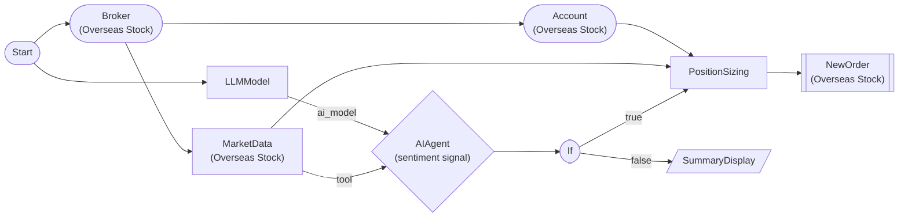

# AI 뉴스감성 자동매매 (해외주식)

AIAgentNode가 시세를 분석해 매수/홀드/매도 신호만 내고, 매수 신호일 때만 PositionSizingNode가 계좌 잔고·리스크 기준으로 주문 수량을 산출해 매수 주문을 넣는 올바른 패턴.

> ## AI 뉴스감성 자동매매

AI는 감성/신호(buy/hold/sell)만 판단하고, 주문 수량은 사람이 정한 리스크 규칙(PositionSizingNode)으로 계산한다.

**대상**: AAPL (NASDAQ)
**신호**: AIAgentNode 구조화 출력(signal=buy/hold/sell, confidence)
**포지션**: 계좌의 10% (fixed_percent)
**안전장치**: 매수 신호일 때만 진입(IfNode), 수량은 PositionSizing이 산출

> ## 왜 이 구조인가 (안티패턴 회피)

AI의 응답은 감성/신호이지 수량이 아니다. AI 응답을 주문 수량에 직결하면(`order.quantity = {{ nodes.<agent>.response... }}`) 0주·음수·엉뚱한 수량으로 발주될 위험이 있다. 그래서:

### 1. AIAgentNode는 신호만 낸다
`output_format=structured` + `output_schema`로 `signal`(buy/hold/sell)과 `confidence`만 받는다. 수량/금액은 절대 AI가 정하지 않는다. structured 출력에는 `output_schema`가 반드시 있어야 한다.

### 2. IfNode가 신호를 게이트한다
`{{ nodes.sentiment_agent.response.signal }} == "buy"`일 때만 매수 경로로 분기한다. hold/sell이면 매매를 보류하고 요약만 표시한다.

### 3. PositionSizingNode가 수량을 산출한다
계좌 잔고(`orderable_amount`)와 리스크 규칙(`fixed_percent`, 10%)으로 주문 수량을 계산한다. 주문 노드는 그 결과를 `order: {{ nodes.sizing.order }}`로 바인딩한다 — AI 응답이나 하드코딩된 고정 수량을 쓰지 않는다.

> ## 실행 흐름

시세 조회(MarketData)
  -> AIAgentNode 감성 분석(structured: signal/confidence)
    -> IfNode 신호 분기
      -> TRUE(buy): PositionSizing 수량 산출 -> 매수 주문
      -> FALSE(hold/sell): SummaryDisplay 보류 표시

## Workflow Structure

## Node List

| ID | Type | Description |
|----|------|------|
| start | StartNode | Workflow start |
| broker | OverseasStockBrokerNode | Overseas stock broker connection |
| account | OverseasStockAccountNode | Overseas stock account balance/position query |
| llm | LLMModelNode | LLM model connection (Claude Haiku) |
| market | OverseasStockMarketDataNode | Overseas stock current price/quote query |
| sentiment_agent | AIAgentNode | AI sentiment analysis — emits signal only (buy/hold/sell), never quantity |
| if_buy | IfNode | Conditional branch — proceed only on buy signal |
| sizing | PositionSizingNode | Position sizing calculation (quantity from account/risk) |
| buy_order | OverseasStockNewOrderNode | Overseas stock new order (binds order to sizing output) |
| no_trade | SummaryDisplayNode | Summary dashboard (no-trade branch) |

## Key Settings

- **broker**: Live trading mode
- **account**: balance/position query
- **llm**: model=`claude-haiku-4-5-20251001`, temperature=0.3, max_tokens=1500
- **market**: symbol AAPL (NASDAQ)
- **sentiment_agent**: output_format=`structured`, output_schema=`{ signal: buy|hold|sell, confidence, reasoning }`, max_tool_calls=0, cooldown_sec=300
- **sentiment_agent**: emits the trade SIGNAL only — never the order quantity
- **if_buy**: `{{ nodes.sentiment_agent.response.signal }}` == `buy`
- **sizing**: method=`fixed_percent`, max_percent=10, balance=`{{ nodes.account.balance.orderable_amount }}`, market_data=`{{ nodes.market.value }}`
- **buy_order**: side=`buy`, order_type=`limit`, order=`{{ nodes.sizing.order }}` (NOT the AI response, NOT a hardcoded quantity)

## Required Credentials

| ID | Type | Description |
|----|------|------|
| broker_cred | broker_ls_overseas_stock | LS Securities Overseas Stock API |
| llm_cred | llm_anthropic | Anthropic LLM API (for the AI agent) |

## Data Flow

1. **start** (StartNode) --> **broker** (OverseasStockBrokerNode)
1. **broker** (OverseasStockBrokerNode) --> **account** (OverseasStockAccountNode)
1. **broker** (OverseasStockBrokerNode) --> **market** (OverseasStockMarketDataNode)
1. **start** (StartNode) --> **llm** (LLMModelNode)
1. **llm** (LLMModelNode) --ai_model--> **sentiment_agent** (AIAgentNode)
1. **market** (OverseasStockMarketDataNode) --tool--> **sentiment_agent** (AIAgentNode)
1. **sentiment_agent** (AIAgentNode) --> **if_buy** (IfNode)
1. **account** (OverseasStockAccountNode) --> **sizing** (PositionSizingNode)
1. **market** (OverseasStockMarketDataNode) --> **sizing** (PositionSizingNode)
1. **if_buy** (IfNode) --true--> **sizing** (PositionSizingNode)
1. **sizing** (PositionSizingNode) --> **buy_order** (OverseasStockNewOrderNode)
1. **if_buy** (IfNode) --false--> **no_trade** (SummaryDisplayNode)
