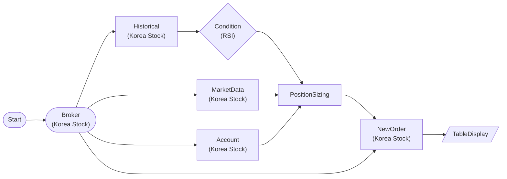

# Korea Stock RSI Oversold Buy Order

Samsung Electronics (005930) daily RSI(14) oversold signal → live KRX quote → PositionSizing (5% of orderable cash) → KoreaStockNewOrderNode limit buy. Korea stocks do NOT support paper trading — orders hit the real account immediately.

## Workflow Structure

## Node List

| ID | Type | Description |
|----|------|------|
| start | StartNode | Workflow start |
| broker | KoreaStockBrokerNode | Korea stock broker connection (real account only) |
| account | KoreaStockAccountNode | Orderable cash / positions |
| historical | KoreaStockHistoricalDataNode | 60-day adjusted daily OHLCV for 005930 (single `symbol` object) |
| rsi_cond | ConditionNode (RSI) | RSI(14) < 30 oversold filter → passed_symbols |
| market | KoreaStockMarketDataNode | Live KRX quote (`symbols` array → `values`) for sizing |
| sizing | PositionSizingNode | fixed_percent 5% of orderable cash → order dict |
| order | KoreaStockNewOrderNode | Limit buy (side=buy, order_type=limit) |
| order_table | TableDisplayNode | Order execution audit log |

## Required Credentials

| ID | Type | Description |
|----|------|------|
| kr_broker_cred | broker_ls_korea_stock | LS Securities Korea Stock API (real account) |

## Notes

- **No paper trading**: KoreaStockBrokerNode is real-market only. To study the flow without executing, drop the `order` node and inspect `sizing.orders` via a display node (live-verified: sizing emits `orders`/`order` when a symbol passes and the account can afford ≥1 share).
- **Single-symbol pipeline**: `historical` takes a single `symbol` object (`{symbol, exchange}`) and emits `value.time_series`; `rsi_cond` reads `{{ nodes.historical.value.time_series }}`. `market` uses a `symbols` **array** and emits `values` — sizing binds `market_data = {{ nodes.market.values }}`. To widen to several tickers, replicate the `historical + rsi_cond` chain per symbol (the historical node accepts only one symbol — an array or SplitNode silently yields 0 bars live).
- Sizing wiring (all live-verified): `symbols = {{ nodes.rsi_cond.passed_symbols }}`, `market_data = {{ nodes.market.values }}` (plural — never `.value`), `balance = {{ nodes.account.balance.orderable_amount }}` (the scalar field, not the raw dict).
- The `order` dict for Korea stocks uses `{symbol, quantity, price?}` — no exchange field.
- Retry stays disabled by default to prevent duplicate KRW-denominated orders.
