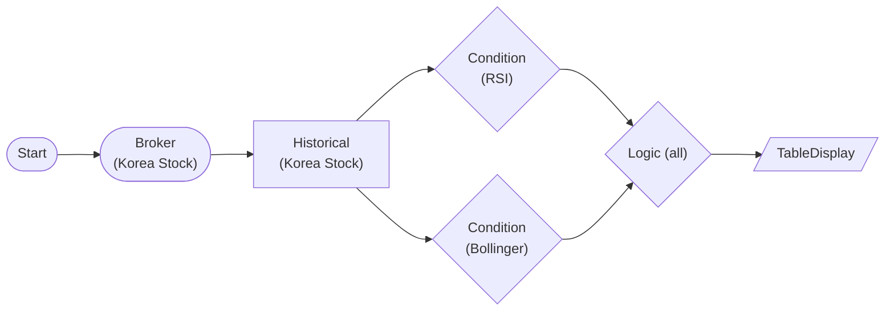

# Korea Stock Compound Condition Strategy (RSI + Bollinger AND)

Evaluate RSI(14) oversold AND Bollinger lower-band breach on Samsung Electronics (005930) daily bars, then combine with LogicNode(all) so a symbol survives only when both indicators agree. Query/strategy only — no orders.

## Workflow Structure

## Node List

| ID | Type | Description |
|----|------|------|
| start | StartNode | Workflow start |
| broker | KoreaStockBrokerNode | Korea stock broker connection |
| historical | KoreaStockHistoricalDataNode | 120-day adjusted daily OHLCV for 005930 (single `symbol` object) |
| rsi_cond | ConditionNode (RSI) | RSI(14) < 30 oversold |
| boll_cond | ConditionNode (BollingerBands) | 20/2.0 lower-band breach (below_lower) |
| logic | LogicNode | operator=all → both conditions must pass |
| table | TableDisplayNode | Symbols passing both filters |

## Required Credentials

| ID | Type | Description |
|----|------|------|
| kr_broker_cred | broker_ls_korea_stock | LS Securities Korea Stock API |

## Notes

- Both ConditionNodes read the same series via `{{ nodes.historical.value.time_series }}` and must include `exchange` in `extract` (RSI/BollingerBands `required_fields = [symbol, exchange, date, close]`; domestic stocks carry no exchange, so a literal `"KRX"` is used). Omitting `exchange` makes the condition return `passed_symbols: []` silently.
- LogicNode `all` = intersection of the two conditions' `passed_symbols` (live-verified: yields the symbol when both fire, empty otherwise); use `any` for a union (OR).
- **Single-symbol screening**: this pattern combines multiple indicators on ONE symbol. To screen SEVERAL symbols, replicate the `historical` node per symbol — `KoreaStockHistoricalDataNode` takes only a single `symbol` object, so an array or a SplitNode fan-out silently produces 0 bars at live runtime (a single LogicNode cannot AND across per-symbol chains either).
- Extend by feeding `logic.passed_symbols` into PositionSizingNode → KoreaStockNewOrderNode for an auto-entry variant (see example 94).
