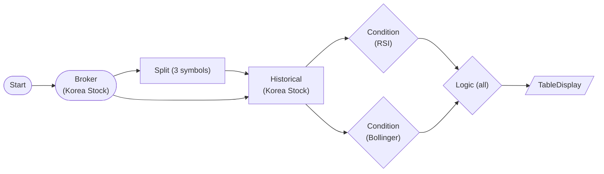

# Korea Stock Compound Condition Strategy (RSI + Bollinger AND)

Evaluate RSI(14) oversold AND Bollinger lower-band breach in parallel across 3 Korean stocks, then combine with LogicNode(all) to filter entry candidates. Query/strategy only — no orders.

## Workflow Structure

## Node List

| ID | Type | Description |
|----|------|------|
| start | StartNode | Workflow start |
| broker | KoreaStockBrokerNode | Korea stock broker connection |
| split | SplitNode | 3 symbols: 005930 / 000660 / 035720 |
| historical | KoreaStockHistoricalDataNode | 120-day adjusted daily OHLCV per symbol |
| rsi_cond | ConditionNode (RSI) | RSI(14) < 30 oversold |
| boll_cond | ConditionNode (BollingerBands) | 20/2.0 lower-band breach (below_lower) |
| logic | LogicNode | operator=all → both conditions must pass |
| table | TableDisplayNode | Symbols passing both filters |

## Required Credentials

| ID | Type | Description |
|----|------|------|
| kr_broker_cred | broker_ls_korea_stock | LS Securities Korea Stock API |

## Notes

- LogicNode `all` = intersection of the two conditions' `passed_symbols`; use `any` for a union (OR).
- Each ConditionNode consumes the per-symbol `{{ item.time_series }}` produced by the item-based historical node.
- Extend by feeding `logic.passed_symbols` into PositionSizingNode → KoreaStockNewOrderNode for an auto-entry variant (see example 94).
