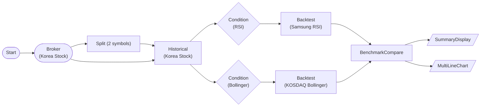

# Korea Stock Backtest (Samsung RSI + KOSDAQ Bollinger)

Backtest a Samsung Electronics (005930, KOSPI) RSI mean-reversion strategy and an Ecopro BM (247540, KOSDAQ) Bollinger lower-band reversion strategy over 1 year of daily bars, then compare Sharpe ratios with BenchmarkCompareNode. Uses Korea-realistic fee / whole-share settings (allow_fractional=false).

## Workflow Structure

## Node List

| ID | Type | Description |
|----|------|------|
| start | StartNode | Workflow start |
| broker | KoreaStockBrokerNode | Korea stock broker connection |
| split | SplitNode | 2 symbols: 005930 (KOSPI) / 247540 (KOSDAQ) |
| historical | KoreaStockHistoricalDataNode | 365-day adjusted daily OHLCV per symbol |
| rsi_cond | ConditionNode (RSI) | RSI(14) < 30 signals |
| boll_cond | ConditionNode (BollingerBands) | 20/2.0 lower-band signals |
| backtest_samsung_rsi | BacktestEngineNode | Samsung RSI mean-reversion (values[0]) |
| backtest_kosdaq_bollinger | BacktestEngineNode | KOSDAQ Bollinger reversion (values[1]) |
| benchmark | BenchmarkCompareNode | Rank both strategies by Sharpe |
| summary | SummaryDisplayNode | Ranking summary card |
| equity_chart | MultiLineChartNode | Combined equity curves |

## Required Credentials

| ID | Type | Description |
|----|------|------|
| kr_broker_cred | broker_ls_korea_stock | LS Securities Korea Stock API |

## Notes

- **allow_fractional=false**: Korean stocks trade in whole shares only.
- **commission_rate 0.00015** approximates brokerage; the ~0.18% sell-side transaction tax is separate — raise commission_rate to a round-trip figure for a conservative backtest.
- **adjust=true** applies split/dividend-adjusted prices for accurate long-term returns.
- Signal mapping: the ConditionNode annotates each candle with `row.signal` (buy/sell) + `row.side`, consumed directly by the BacktestEngine. Each backtest reads its symbol's slice via `nodes.<cond>.values[i].time_series`.
