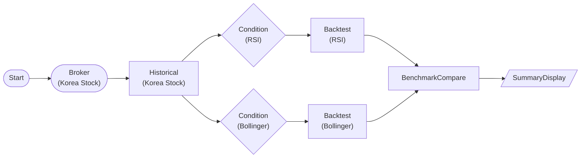

# Korea Stock Backtest (Samsung RSI vs Bollinger)

Backtest two strategies on one year of Samsung Electronics (005930) daily bars — an RSI(14) mean-reversion strategy and a Bollinger(20, 2σ) lower-band reversion strategy — then rank them by Sharpe with BenchmarkCompareNode. Both strategies share a single historical fetch.

## Workflow Structure

## Node List

| ID | Type | Description |
|----|------|------|
| start | StartNode | Workflow start |
| broker | KoreaStockBrokerNode | Korea stock broker connection |
| historical | KoreaStockHistoricalDataNode | 365-day adjusted daily OHLCV for 005930 (single `symbol` object) |
| rsi_cond | ConditionNode (RSI) | RSI(14) < 35 signals |
| boll_cond | ConditionNode (BollingerBands) | 20/2.0 lower-band signals |
| backtest_rsi | BacktestEngineNode | Samsung RSI mean-reversion (`nodes.rsi_cond.values[0]`) |
| backtest_bollinger | BacktestEngineNode | Samsung Bollinger reversion (`nodes.boll_cond.values[0]`) |
| benchmark | BenchmarkCompareNode | Rank both strategies by Sharpe |
| summary | SummaryDisplayNode | Ranking summary card |

## Required Credentials

| ID | Type | Description |
|----|------|------|
| kr_broker_cred | broker_ls_korea_stock | LS Securities Korea Stock API |

## Notes

- **One historical, two strategies.** Both conditions read the same `{{ nodes.historical.value.time_series }}`, so only one chart fetch runs. Comparing *different* symbols would need one `KoreaStockHistoricalDataNode` per symbol, but Korean chart continuous-queries bypass the rate-limit wait — running two heavy fetches back-to-back in one session can make the second silently return 0 bars (live-observed). `KoreaStockHistoricalDataNode` also takes only a single `symbol` object (no array / SplitNode).
- **Engine reads only 4 params.** BacktestEngineNode consumes `initial_capital`, `commission_rate`, `slippage`, `allow_short` only. `position_sizing` / `stop_loss` / `take_profit` / `time_stop` / `allow_fractional` etc. are NOT read by the current engine, so they are omitted (they would be silently ignored).
- **Fractional shares.** Fill quantity is capital-proportional and comes out fractional — the engine does not round to whole shares, so Korea's whole-share rule is not modeled here.
- **commission_rate 0.00015** approximates brokerage; the ~0.18% sell-side transaction tax is separate — raise commission_rate to a round-trip figure for a conservative backtest. **adjust=true** applies split/dividend-adjusted prices.
- Signal mapping: the ConditionNode annotates each candle with `row.signal` (buy/sell) + `row.side`, consumed directly by the BacktestEngine (live-verified: 3 trades each, metrics + Sharpe ranking populated). Per-strategy equity curves live in each backtest node's `equity_curve` output.
