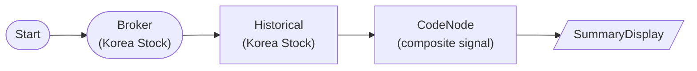

# Korea Stock CodeNode Composite Indicator (RSI + Bollinger %b + ATR)

Fetch Samsung Electronics (005930) daily bars, then hand-roll a composite entry signal in a CodeNode using stdlib only: Wilder RSI, Bollinger %b, and ATR-derived stop/target prices. Educational hand-roll reference for the RSI/Bollinger plugins.

## Workflow Structure

## Node List

| ID | Type | Description |
|----|------|------|
| start | StartNode | Workflow start |
| broker | KoreaStockBrokerNode | Korea stock broker connection |
| historical | KoreaStockHistoricalDataNode | 120-day adjusted daily OHLCV (005930) |
| composite | CodeNode | Wilder RSI + Bollinger %b + ATR stop/target → composite buy signal |
| display | SummaryDisplayNode | Signal summary card |

## Required Credentials

| ID | Type | Description |
|----|------|------|
| kr_broker_cred | broker_ls_korea_stock | LS Securities Korea Stock API |

## CodeNode Contract

- **Input** `data` = `{{ nodes.historical.value }}` → `{symbol, time_series: [{date, open, high, low, close, volume}, ...]}`.
- **params**: `rsi_period` (14), `bb_period` (20), `atr_period` (14), `rsi_oversold` (30), `pctb_threshold` (0.1).
- **Output** `signal` (object): `{symbol, close, rsi, percent_b, atr, action, stop_price, target_price, status}`.
- **Guards**: fewer than `max(period)+1` candles → `status='insufficient_data'`, `action='flat'`. Degenerate (zero-width) Bollinger band → `percent_b=None`.
- **Signal logic**: `action='buy'` when `rsi < rsi_oversold` AND `percent_b < pctb_threshold`; stop = close − 2·ATR, target = close + 3·ATR (rounded to whole KRW).
- stdlib only (`statistics`), dry_run-safe.
