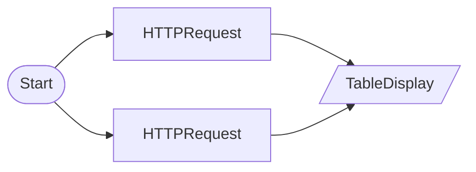

# Retry Test

HTTPRequestNode Retry/Fallback feature test. Uses python_server test endpoints. Server required: poetry run python examples/python_server/server.py

## Workflow Structure



## Node List

| ID | Type | Description |
|----|------|------|
| start | StartNode | Workflow start |
| flaky_api | HTTPRequestNode | HTTP API request |
| slow_api | HTTPRequestNode | HTTP API request |
| result | TableDisplayNode | Table display output |

## Key Settings

- **flaky_api**: `http://localhost:8766/api/test/fail-then-succeed?fail_count=2`
- **slow_api**: `http://localhost:8766/api/test/slow?delay=1`

## Data Flow

1. **start** (StartNode) --> **flaky_api** (HTTPRequestNode)
1. **start** (StartNode) --> **slow_api** (HTTPRequestNode)
1. **flaky_api** (HTTPRequestNode) --> **result** (TableDisplayNode)
1. **slow_api** (HTTPRequestNode) --> **result** (TableDisplayNode)

## How to Run

```python
from programgarden import ProgramGarden

pg = ProgramGarden()
job = await pg.run_async(workflow)
```
